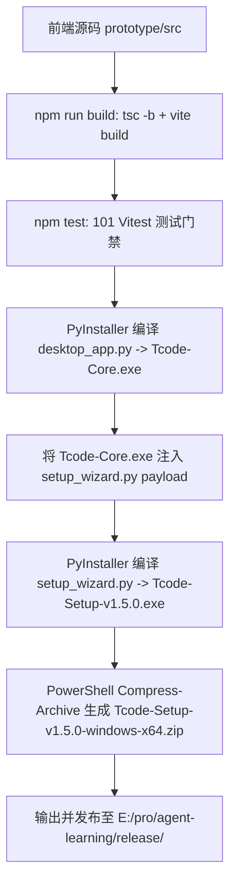

# Tcode Windows 安装包构建与发布 Skill (`build-windows-installer`)

本 Skill 用于将当前工程完整编译并构建为 Tcode 官方标准单文件安装向导 (`Tcode-Setup-v1.5.0.exe`) 与分发压缩包 (`Tcode-Setup-v1.5.0-windows-x64.zip`)，统一输出至 `E:\pro\agent-learning\release\` 目录。

## 适用场景
- 完成功能开发或修复后，需要打包发布 Tcode 桌面端安装向导与 zip 分发包；
- 验证生产环境下的前端静态资源是否完整嵌入桌面端；
- 需要验证全量 101 个单元测试与 PyInstaller 桌面宿主打包流水线。

## 构建流水线 (Build Pipeline)



## 执行命令

在项目根目录 `E:\pro\agent-learning` 执行以下命令即可一键完成：

```bash
# 执行标准打包脚本
python build_installer.py
```

## 产出物与交付契约
- **安装向导文件**：`E:\pro\agent-learning\release\Tcode-Setup-v1.5.0.exe`
- **压缩分发包**：`E:\pro\agent-learning\release\Tcode-Setup-v1.5.0-windows-x64.zip`
