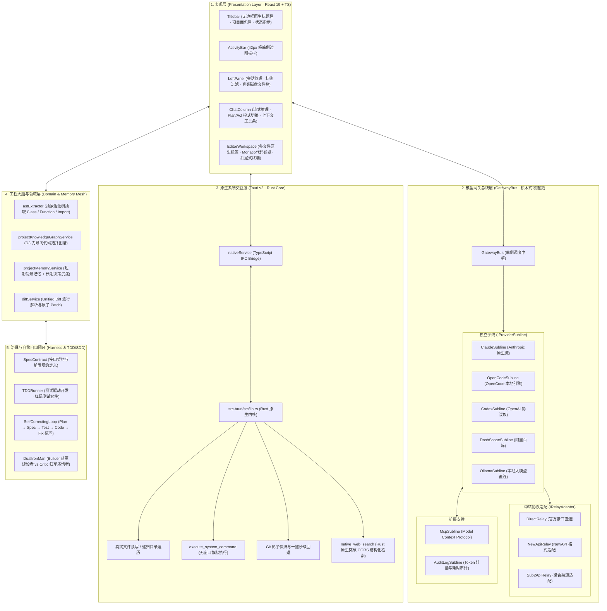
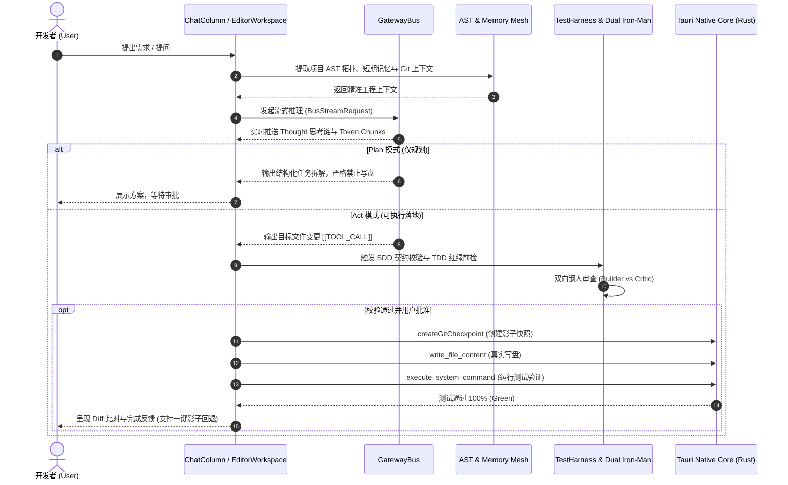

# CodeMind-Hub 全景架构设计规范 (ARCHITECTURE.md)

> **设计哲学**：单一主轴、高度解耦、积木思想、Harness 治具思想、ReAct 循环思想，拒绝过度封装。  
> 基于 **Tauri v2 (Rust 原生内核) + React 19 + TypeScript + GatewayBus 积木总线**。

---

## 🏛️ 一、分层解耦架构全景图 (Layered Architecture)

---

## 🔄 二、ReAct 智能体与自愈闭环数据流 (Dataflow Sequence)

---

## 📐 三、模块解耦规约 (Decoupling Principles)

1. **零循环依赖**：`services/bus/` 绝不反向依赖 UI 组件，仅通过纯接口（`IProviderSubline`, `BusStreamRequest`, `BusStreamCallbacks`）通信；
2. **单一职责 (SRP)**：每个厂商子线独立文件（`ClaudeSubline.ts`, `OpenCodeSubline.ts` 等），新增厂商只需实现标准子线接口注册至 `GatewayBus`，无需修改任何 UI 代码；
3. **安全第一 (Safety First)**：所有系统命令与文件写操作均通过 Tauri IPC 约束并在执行前自动触发 Git 影子快照，确保随时可秒级还原。
