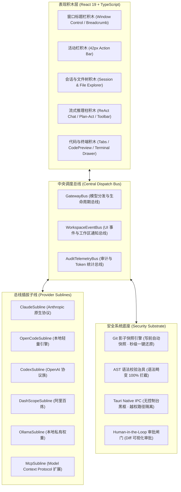

# CodeMind-Hub 产品需求与架构设计规范 (PRD)

> **产品代号**：CodeMind-Hub  
> **核心主张**：基于“总线-子线”与“搭积木”的极简安全 AI 编程桌面工作台 (Cursor-Alternative Native IDE)  
> **责任团队**：Agent 产品经理、UI/UX 设计师、前端架构师、Rust 原生核心工程师、Python 治具工程师

---

## 🎯 一、产品战略定位与核心哲学

### 1.1 核心三大基础理念
1. **总线与子线思想 (Bus & Subline)**：
   - 系统核心只有一个调度总线（`GatewayBus` / `EventBus`），负责状态同步、上下文路由与生命周期管理；
   - 所有模型供应商（Claude、OpenCode、Codex、阿里百炼、Ollama）、MCP 工具、技能包（Skills）均作为**“挂载在总线上的子线插件”**；
   - 任意子线的热插拔、降级切换（Failover）与扩展，绝不影响总线自身稳定性。
2. **搭积木思想 (Building Blocks)**：
   - 拒绝大而全的面条式代码与过度封装，每个模块（文件树、对话流、编辑器、终端、AST 分析器、Diff 引擎）独立封装成可单独测试的积木块；
   - 开发者可像搭积木一样自由装配与替换能力。
3. **安全系统底座 (Security Substrate)**：
   - 彻底解决开发者对 AI 编程的核心心理障碍：**失控恐惧（害怕代码被写乱）与环境破坏**；
   - 建立 4 道不可穿透的安全防线：AST 语法前检 → Git 影子快照检查点 → 人类审批透明隔离 → 无窗口静默沙箱执行。

---

## 🔍 二、GitHub Top 20 竞品深度洞察与取舍矩阵

| 竞品名称 | 核心亮点 (吸收进本项目) | 核心痛点与缺陷 (本项目严格规避) | 本项目吸收转化设计 |
| :--- | :--- | :--- | :--- |
| **Cursor** | 多文件协同感强，代码流式渲染极致流畅 | 商业闭源、代码索引强制上传云端、订阅捆绑 | 打造 100% 本地开源、自托管模型连接的 Cursor 级桌面体验 |
| **Cline** | Plan / Act 双模式，工具调用透明可见 | 长任务 Token 消耗极度恐怖，单步确认过于繁琐 | 引入一键 Plan/Act 胶囊切换，支持批量预检与智能压缩 |
| **Aider** | Git 深度绑定，写代码自动 Commit，极其轻量省 Token | 纯命令行 CLI 界面，缺乏可视化的富文本 Diff 审批和图谱分析 | 吸收其 Git 影子快照机制，在桌面端做成一键“↩️ 影子回退”按钮 |
| **Continue** | 任意自填 API Key / Ollama 本地模型，无侵入 | 缺乏端到端 Agentic 多步自主规划和自愈修复闭环 | 吸收其全渠道自由配置能力，纳入 GatewayBus 子线管理 |
| **Windsurf** | "Cascade" 流式上下文追溯，响应极快 | 闭源私有生态，不支持自定义复杂 Relay 渠道 | 吸收其紧凑上下文条设计，融入项目 AST 图谱关联 |
| **Void** | 开源 Cursor 替代思路，基于 VS Code Fork | 维护庞大的 VS Code Fork 极其沉重，版本更新易脱节 | 摆脱沉重的 VS Code Fork 体系，采用轻量独立的 Tauri v2 桌面宿主 |
| **OpenHands** | 完整的全自动化软件工程师 Agent | 极度沉重，强依赖 Docker 环境，个人本地冷启动门槛极高 | 剔除沉重容器依赖，采用极简无黑框原生系统调用 |
| **Roo Code** | 多角色分工（Architect / Coder / Ask） | 规则配置繁复，新手认知成本高 | 简化为“📐 架构规划”与“💻 编码落地”双模式极速热切 |
| **Spec-kit** | 规范先行（Spec-driven），接口契约前置 | 缺少与即时交互界面的深度打通，多为离线脚本 | 融入 SDD + TDD 强制工作流，编码前在对话卡片中自动显式呈现 Spec |
| **Ollama** | 本地模型离线运行，隐私保护极致 | 纯命令行推理运行时，无 IDE 交互面板 | 作为本地第一公民子线挂载在 GatewayBus，开箱即选 |

---

## 🧩 三、总线-子线积木式系统架构蓝图



---

## 🛡️ 四、安全系统底座的四道坚实防线

1. **第一道防线：人类在环确认闸门 (Human-in-the-Loop Approval)**
   - 在 Plan 模式下：严格拦截一切写文件和执行指令行为，仅输出只读分析与步骤拆解；
   - 在 Act 模式下：输出文件修改均封装为标准 `[[TOOL_CALL]]` 结构，提供实时 Unified Diff 增删对比，必须由用户点击 `⚡ diff` 并审批才触发真实落盘。
2. **第二道防线：AST 语法树前检治具 (AST Pre-flight Guard)**
   - AI 输出的代码在写入磁盘前，由 AST 分析器进行语法校验；
   - 若解析失败直接在内存拦截，触发自愈引擎（Self-Correcting Loop）重新生成，杜绝向项目写入破坏性残缺代码。
3. **第三道防线：Git 影子检查点机制 (Git Shadow Checkpoint)**
   - 在执行写入前，系统无条件执行 `createGitCheckpoint`，自动暂存或打上快照标（`[CodeMind Checkpoint]`）；
   - 编辑器顶部提供常驻 **`↩️ 影子回退`** 按钮，点击即可调用 `git reset --hard` 秒级还原，给开发者绝对的安全掌控感。
4. **第四道防线：Tauri 原生无黑框进程隔离 (Native Headless Isolation)**
   - 底层系统命令通过 Rust 原生通道调用，Windows 环境配置 `CREATE_NO_WINDOW` 标志，消除命令行控制台弹窗干扰，同时做严格的目录访问边界限制。

---

## 🎨 五、UI/UX 人体工程学设计规范 (Cursor 风格柔和暖色)

1. **色彩基调 (Warm Minimalist Palette)**：
   - **基底色 (App Base)**：`#FAF8F5` (Warm Cream 柔和暖米白，告别纯白眩光与深黑压抑)；
   - **工作台表面 (Surface)**：`#F4EFEA` (Warm Soft Ivory，建立微弱柔和层级)；
   - **强调色 (Accent)**：`#D96B27` (低饱和陶土暖橙，克制用于运行、当前活动状态与高亮)；
   - **代码/终端块**：`#1E1C1A` (暖炭黑底色搭配 `#A3E635` 柔和荧光绿字符)。
2. **布局人体工程学 (16:9 Ergonomic Ratio)**：
   - **42px 窄图标活动栏**：极简单列，包含文件、搜索、Git、图谱、网关配置入口；
   - **240px 左侧面板**：包含会话管理（支持 `#feat`、`#coding` 标签与搜索）和真实磁盘树；
   - **弹性 45% 中间流式对话区**：纵向聊天卡片排布，代码块右下角附微型微动操作按钮（`📋 复制`、`⚡ diff`、`👍`），输入框上方固定横向工具条（`+ add context`、模型选择、分支选择、附件）；
   - **弹性 55% 右侧代码与终端工作区**：顶部纯净文件多标签页（`🐍 task_solver.py ✕`），右侧紧凑保留 `📟 终端`、`💾 保存`、`▶ 运行`，底部 24px 抽屉式终端把手，点击展开。
3. **无干扰设计原则**：
   - 禁止多余装饰性网格卡片；禁止拟物高光投影；控件高度严格控制在 24-28px，将 80% 以上屏幕面积归还代码与逻辑。

---

## 🤝 六、人机协同动态交互选择体系 (Dynamic Human-in-the-Loop Selection)

### 6.1 核心定义与设计意图
在真实的复杂工程实践中，AI 编码最容易引起开发者反感的行为是：**在遇到技术路径分叉时擅自盲猜，一次性写出数百行违背架构意图的代码**。
CodeMind-Hub 提出**“人类在环动态交互选择体系”**，将决策权归还开发者：
- **挂起与唤醒机制 (Suspend & Resume)**：当 Agent 检测到需求歧义、架构多重可行路径或高危操作时，立即主动挂起推理，以结构化微型卡片向用户提问；
- **零认知负担**：摒弃让用户手工输入长段文本解释的做法，提供**选项卡片 + 推荐标识 + 自定义补充**，一键点击即完成精准决策；
- **审计与上下文注入**：用户的每一次动态选择均沉淀为结构化事实（Decision Fact），注入短期记忆与总线上下文。

### 6.2 五大核心互动场景 (Interactive Scenarios)

```
              ┌────────────────────────────────────────────────────────┐
              │           Agent 执行中触发歧义 / 决策分叉               │
              └───────────────────────────┬────────────────────────────┘
                                          │
       ┌──────────────────┬───────────────┴───────────────┬──────────────────┐
       ▼                  ▼                               ▼                  ▼
【1. 架构方案分叉】   【2. 风险半径确认】           【3. 自愈策略抉择】   【4. 模糊需求对齐】
- Zustand vs Redux   - 批量改动 10 个文件           - 构建失败时：         - "优化性能"：
- REST vs GraphQL    - 是否执行数据迁移             - 回退上一检查点      - 缓存策略
- 极简实现 vs 全面抽象  - 需先生成影子快照吗？          - 自动 Patch 修复     - 算法复杂度优化
```

1. **架构/方案分叉决策 (Architecture Fork)**：
   - 示例：`"检测到现有工程使用 Zustand，新增的状态逻辑是扩展现有 Store 还是新建独立 Slice？"`
   - 选项：`[A. 扩展现有 Store (推荐)]` / `[B. 新建独立 Slice]` / `[C. 仅作为组件本地 State]`。
2. **高危操作与爆炸半径确认 (Risk & Blast Radius)**：
   - 示例：`"本轮重构将涉及 8 个文件的公共接口签名调整，预计影响范围较大："`
   - 选项：`[A. 创建 Git 影子快照并直接执行]` / `[B. 逐个文件预览 Diff 并审批]` / `[C. 终止并切换到 Plan 模式]`。
3. **测试红灯自愈策略抉择 (Self-Healing Strategy)**：
   - 示例：`"TDD 前置测试未通过 (2 个用例报错)："`
   - 选项：`[A. 允许智能体自动生成修复补丁 (推荐)]` / `[B. 回退至上一影子快照]` / `[C. 暂停让我手动调试]`。
4. **模糊需求与技术偏好对齐 (Ambiguity Clarification)**：
   - 示例：`"您要求增加用户鉴权，请选择期望的鉴权底座："`
   - 选项：`[A. JWT 无状态 Token (推荐)]` / `[B. Session Cookie]` / `[C. OAuth 第三方登录]`。
5. **自定义补充输入 (Custom Write-in Input)**：
   - 在所有选项下方预留 `[ 📝 补充其他要求... ]` 输入框，支持用户勾选选项的同时一句话补充边界要求。

### 6.3 交互协议与数据契约 (Interaction Protocol)

大模型在流式回复末尾或执行中触发特定协议块：
```markdown
[[ASK_OPTIONS]]
{
  "type": "ask_options",
  "question": "检测到组件拆分需求，请选择拆分粒度：",
  "single_select": true,
  "options": [
    {
      "id": "atomic",
      "label": "原子化细粒度拆分 (Recommended)",
      "description": "每个状态与渲染逻辑拆为独立子组件，可复用性高"
    },
    {
      "id": "monolithic",
      "label": "保持单一组件内部解耦",
      "description": "仅提取纯函数与 Hook，减少文件数量"
    }
  ],
  "allow_custom_input": true
}
```

### 6.4 UI/UX 人体工程学规范 (Options Card UI)
- **色调与形态**：采用柔和暖米白底色搭配细边框，高亮选中使用陶土暖橙高对比边框（`#D96B27`）；
- **微交互**：单选圆点（RadioButton）/ 多选复选框（Checkbox），带有轻量选中跳动动画；
- **状态流转**：用户点击确认后，卡片无缝折叠为高度 24px 的纯净决策胶囊（例如：`✔ 已选择：原子化细粒度拆分`），不可重复点按，避免界面凌乱。

---

## 🚀 七、功能排期与优先级规划 (MoSCoW Matrix)

| 优先级 | 功能模块 | 描述与价值 |
| :--- | :--- | :--- |
| **P0 (Must-Have)** | **GatewayBus 核心总线** | 支持多渠道（OpenCode、Claude、Codex、百炼、Ollama）秒级热切换与子线注册 |
| **P0 (Must-Have)** | **安全底座 (Git 检查点)** | 任何写入操作前自动快照，界面一键秒级影子回退 (Revert) |
| **P0 (Must-Have)** | **Plan/Act 双模式切换** | 输入框上方一键切换：Plan 只分析不写盘，Act 执行落地 |
| **P0 (Must-Have)** | **人机动态选择卡片 (OptionsCard)** | 推理遇到分叉时主动挂起，支持单选/多选/自定义补充并即时唤醒 |
| **P0 (Must-Have)** | **SDD + TDD 工作流** | 编码前自动在对话流中输出 Spec 契约与前置红绿测试 |
| **P1 (Should-Have)** | **真实工程 AST 知识图谱** | 提取类名、函数签名与调用关系，轻量注入 System Prompt |
| **P1 (Should-Have)** | **单文件原生安装包套件** | 一键增量构建单文件图形化安装包，真实一键部署 |
| **P2 (Could-Have)** | **MCP 协议子线动态挂载** | 兼容 Model Context Protocol 本地工具动态导入 |
| **P3 (Won't-Have)** | **复杂虚拟多 Agent 公司** | 坚决剔除 MetaGPT 式产品经理/UI/测试员互相对话的虚幻冗余消耗，坚持实用结对 |
