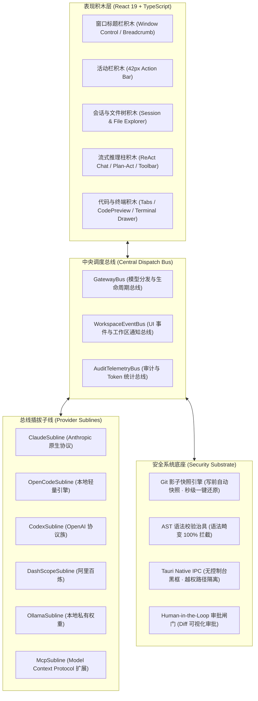

# CodeMind-Hub 产品需求与架构设计规范 (PRD)

> **产品代号**：CodeMind-Hub  
> **核心主张**：基于“总线-子线”与“搭积木”的极简安全 AI 编程桌面工作台 (Cursor-Alternative Native IDE)  
> **责任团队**：Agent 产品经理、UI/UX 设计师、前端架构师、Rust 原生核心工程师、Python 治具工程师

---

## 🎯 一、产品战略定位与核心哲学

### 1.1 核心三大基础理念
1. **总线与子线思想 (Bus & Subline)**：
   - 系统核心只有一个调度总线（`GatewayBus` / `EventBus`），负责状态同步、上下文路由与生命周期管理；
   - 所有模型供应商（Claude、OpenCode、Codex、阿里百炼、Ollama）、MCP 工具、技能包（Skills）均作为**“挂载在总线上的子线插件”**；
   - 任意子线的热插拔、降级切换（Failover）与扩展，绝不影响总线自身稳定性。
2. **搭积木思想 (Building Blocks)**：
   - 拒绝大而全的面条式代码与过度封装，每个模块（文件树、对话流、编辑器、终端、AST 分析器、Diff 引擎）独立封装成可单独测试的积木块；
   - 开发者可像搭积木一样自由装配与替换能力。
3. **安全系统底座 (Security Substrate)**：
   - 彻底解决开发者对 AI 编程的核心心理障碍：**失控恐惧（害怕代码被写乱）与环境破坏**；
   - 建立 4 道不可穿透的安全防线：AST 语法前检 → Git 影子快照检查点 → 人类审批透明隔离 → 无窗口静默沙箱执行。

---

## 🔍 二、GitHub Top 20 竞品深度洞察与取舍矩阵

| 竞品名称 | 核心亮点 (吸收进本项目) | 核心痛点与缺陷 (本项目严格规避) | 本项目吸收转化设计 |
| :--- | :--- | :--- | :--- |
| **Cursor** | 多文件协同感强，代码流式渲染极致流畅 | 商业闭源、代码索引强制上传云端、订阅捆绑 | 打造 100% 本地开源、自托管模型连接的 Cursor 级桌面体验 |
| **Cline** | Plan / Act 双模式，工具调用透明可见 | 长任务 Token 消耗极度恐怖，单步确认过于繁琐 | 引入一键 Plan/Act 胶囊切换，支持批量预检与智能压缩 |
| **Aider** | Git 深度绑定，写代码自动 Commit，极其轻量省 Token | 纯命令行 CLI 界面，缺乏可视化的富文本 Diff 审批和图谱分析 | 吸收其 Git 影子快照机制，在桌面端做成一键“↩️ 影子回退”按钮 |
| **Continue** | 任意自填 API Key / Ollama 本地模型，无侵入 | 缺乏端到端 Agentic 多步自主规划和自愈修复闭环 | 吸收其全渠道自由配置能力，纳入 GatewayBus 子线管理 |
| **Windsurf** | "Cascade" 流式上下文追溯，响应极快 | 闭源私有生态，不支持自定义复杂 Relay 渠道 | 吸收其紧凑上下文条设计，融入项目 AST 图谱关联 |
| **Void** | 开源 Cursor 替代思路，基于 VS Code Fork | 维护庞大的 VS Code Fork 极其沉重，版本更新易脱节 | 摆脱沉重的 VS Code Fork 体系，采用轻量独立的 Tauri v2 桌面宿主 |
| **OpenHands** | 完整的全自动化软件工程师 Agent | 极度沉重，强依赖 Docker 环境，个人本地冷启动门槛极高 | 剔除沉重容器依赖，采用极简无黑框原生系统调用 |
| **Roo Code** | 多角色分工（Architect / Coder / Ask） | 规则配置繁复，新手认知成本高 | 简化为“📐 架构规划”与“💻 编码落地”双模式极速热切 |
| **Spec-kit** | 规范先行（Spec-driven），接口契约前置 | 缺少与即时交互界面的深度打通，多为离线脚本 | 融入 SDD + TDD 强制工作流，编码前在对话卡片中自动显式呈现 Spec |
| **Ollama** | 本地模型离线运行，隐私保护极致 | 纯命令行推理运行时，无 IDE 交互面板 | 作为本地第一公民子线挂载在 GatewayBus，开箱即选 |

---

## 🧩 三、总线-子线积木式系统架构蓝图



---

## 🛡️ 四、安全系统底座的四道坚实防线

1. **第一道防线：人类在环确认闸门 (Human-in-the-Loop Approval)**
   - 在 Plan 模式下：严格拦截一切写文件和执行指令行为，仅输出只读分析与步骤拆解；
   - 在 Act 模式下：输出文件修改均封装为标准 `[[TOOL_CALL]]` 结构，提供实时 Unified Diff 增删对比，必须由用户点击 `⚡ diff` 并审批才触发真实落盘。
2. **第二道防线：AST 语法树前检治具 (AST Pre-flight Guard)**
   - AI 输出的代码在写入磁盘前，由 AST 分析器进行语法校验；
   - 若解析失败直接在内存拦截，触发自愈引擎（Self-Correcting Loop）重新生成，杜绝向项目写入破坏性残缺代码。
3. **第三道防线：Git 影子检查点机制 (Git Shadow Checkpoint)**
   - 在执行写入前，系统无条件执行 `createGitCheckpoint`，自动暂存或打上快照标（`[CodeMind Checkpoint]`）；
   - 编辑器顶部提供常驻 **`↩️ 影子回退`** 按钮，点击即可调用 `git reset --hard` 秒级还原，给开发者绝对的安全掌控感。
4. **第四道防线：Tauri 原生无黑框进程隔离 (Native Headless Isolation)**
   - 底层系统命令通过 Rust 原生通道调用，Windows 环境配置 `CREATE_NO_WINDOW` 标志，消除命令行控制台弹窗干扰，同时做严格的目录访问边界限制。

---

## 🎨 五、UI/UX 人体工程学设计规范 (Cursor 风格柔和暖色)

1. **色彩基调 (Warm Minimalist Palette)**：
   - **基底色 (App Base)**：`#FAF8F5` (Warm Cream 柔和暖米白，告别纯白眩光与深黑压抑)；
   - **工作台表面 (Surface)**：`#F4EFEA` (Warm Soft Ivory，建立微弱柔和层级)；
   - **强调色 (Accent)**：`#D96B27` (低饱和陶土暖橙，克制用于运行、当前活动状态与高亮)；
   - **代码/终端块**：`#1E1C1A` (暖炭黑底色搭配 `#A3E635` 柔和荧光绿字符)。
2. **布局人体工程学 (16:9 Ergonomic Ratio)**：
   - **42px 窄图标活动栏**：极简单列，包含文件、搜索、Git、图谱、网关配置入口；
   - **240px 左侧面板**：包含会话管理（支持 `#feat`、`#coding` 标签与搜索）和真实磁盘树；
   - **弹性 45% 中间流式对话区**：纵向聊天卡片排布，代码块右下角附微型微动操作按钮（`📋 复制`、`⚡ diff`、`👍`），输入框上方固定横向工具条（`+ add context`、模型选择、分支选择、附件）；
   - **弹性 55% 右侧代码与终端工作区**：顶部纯净文件多标签页（`🐍 task_solver.py ✕`），右侧紧凑保留 `📟 终端`、`💾 保存`、`▶ 运行`，底部 24px 抽屉式终端把手，点击展开。
3. **无干扰设计原则**：
   - 禁止多余装饰性网格卡片；禁止拟物高光投影；控件高度严格控制在 24-28px，将 80% 以上屏幕面积归还代码与逻辑。

---

## 🤝 六、人机协同动态交互选择体系 (Dynamic Human-in-the-Loop Selection)

### 6.1 核心定义与设计意图
在真实的复杂工程实践中，AI 编码最容易引起开发者反感的行为是：**在遇到技术路径分叉时擅自盲猜，一次性写出数百行违背架构意图的代码**。
CodeMind-Hub 提出**“人类在环动态交互选择体系”**，将决策权归还开发者：
- **挂起与唤醒机制 (Suspend & Resume)**：当 Agent 检测到需求歧义、架构多重可行路径或高危操作时，立即主动挂起推理，以结构化微型卡片向用户提问；
- **零认知负担**：摒弃让用户手工输入长段文本解释的做法，提供**选项卡片 + 推荐标识 + 自定义补充**，一键点击即完成精准决策；
- **审计与上下文注入**：用户的每一次动态选择均沉淀为结构化事实（Decision Fact），注入短期记忆与总线上下文。

### 6.2 五大核心互动场景 (Interactive Scenarios)

```
              ┌────────────────────────────────────────────────────────┐
              │           Agent 执行中触发歧义 / 决策分叉               │
              └───────────────────────────┬────────────────────────────┘
                                          │
       ┌──────────────────┬───────────────┴───────────────┬──────────────────┐
       ▼                  ▼                               ▼                  ▼
【1. 架构方案分叉】   【2. 风险半径确认】           【3. 自愈策略抉择】   【4. 模糊需求对齐】
- Zustand vs Redux   - 批量改动 10 个文件           - 构建失败时：         - "优化性能"：
- REST vs GraphQL    - 是否执行数据迁移             - 回退上一检查点      - 缓存策略
- 极简实现 vs 全面抽象  - 需先生成影子快照吗？          - 自动 Patch 修复     - 算法复杂度优化
```

1. **架构/方案分叉决策 (Architecture Fork)**：
   - 示例：`"检测到现有工程使用 Zustand，新增的状态逻辑是扩展现有 Store 还是新建独立 Slice？"`
   - 选项：`[A. 扩展现有 Store (推荐)]` / `[B. 新建独立 Slice]` / `[C. 仅作为组件本地 State]`。
2. **高危操作与爆炸半径确认 (Risk & Blast Radius)**：
   - 示例：`"本轮重构将涉及 8 个文件的公共接口签名调整，预计影响范围较大："`
   - 选项：`[A. 创建 Git 影子快照并直接执行]` / `[B. 逐个文件预览 Diff 并审批]` / `[C. 终止并切换到 Plan 模式]`。
3. **测试红灯自愈策略抉择 (Self-Healing Strategy)**：
   - 示例：`"TDD 前置测试未通过 (2 个用例报错)："`
   - 选项：`[A. 允许智能体自动生成修复补丁 (推荐)]` / `[B. 回退至上一影子快照]` / `[C. 暂停让我手动调试]`。
4. **模糊需求与技术偏好对齐 (Ambiguity Clarification)**：
   - 示例：`"您要求增加用户鉴权，请选择期望的鉴权底座："`
   - 选项：`[A. JWT 无状态 Token (推荐)]` / `[B. Session Cookie]` / `[C. OAuth 第三方登录]`。
5. **自定义补充输入 (Custom Write-in Input)**：
   - 在所有选项下方预留 `[ 📝 补充其他要求... ]` 输入框，支持用户勾选选项的同时一句话补充边界要求。

### 6.3 交互协议与数据契约 (Interaction Protocol)

大模型在流式回复末尾或执行中触发特定协议块：
```markdown
[[ASK_OPTIONS]]
{
  "type": "ask_options",
  "question": "检测到组件拆分需求，请选择拆分粒度：",
  "single_select": true,
  "options": [
    {
      "id": "atomic",
      "label": "原子化细粒度拆分 (Recommended)",
      "description": "每个状态与渲染逻辑拆为独立子组件，可复用性高"
    },
    {
      "id": "monolithic",
      "label": "保持单一组件内部解耦",
      "description": "仅提取纯函数与 Hook，减少文件数量"
    }
  ],
  "allow_custom_input": true
}
```

### 6.4 UI/UX 人体工程学规范 (Options Card UI)
- **色调与形态**：采用柔和暖米白底色搭配细边框，高亮选中使用陶土暖橙高对比边框（`#D96B27`）；
- **微交互**：单选圆点（RadioButton）/ 多选复选框（Checkbox），带有轻量选中跳动动画；
- **状态流转**：用户点击确认后，卡片无缝折叠为高度 24px 的纯净决策胶囊（例如：`✔ 已选择：原子化细粒度拆分`），不可重复点按，避免界面凌乱。

---

## 🔐 七、权限治理与自主决策引擎 (Permission & Autonomy Governance)

### 7.1 核心痛点与产品动机
- **痛点一 (过度打扰)**：在长链路重构或批量修 Bug 场景下，AI 每改一个文件、执行一条测试都要求用户点一次“确认”，导致开发者产生严重点击疲劳（Confirmation Fatigue）；
- **痛点二 (失控盲跑)**：若完全放任 AI 自主运行，开发者又担心其做出不可逆的破坏性行为（如误删依赖、死循环执行恶性命令）。
- **解决方案**：引入**双轨制权限治理与智能自主抉择引擎**，开发者可在工具栏一键切换控制粒度。

### 7.2 三档权限模式定义 (Permission Modes)

```
        ┌─────────────────────────────────────────────────────────────┐
        │            权限治理策略配置 (Permission Policy)             │
        └──────────────────────────────┬──────────────────────────────┘
                                       │
         ┌─────────────────────────────┼─────────────────────────────┐
         ▼                             ▼                             ▼
【1. 🛡️ 严格逐次审核模式】      【2. 🤖 智能自主决策模式】      【3. ⚡ 风险自适应熔断模式】
- 每次写文件均需人工点击        - 无需人为干预                  - 低风险操作自动放行
- 每次系统命令均需人工点击      - Agent 评估最优路径自动抉择     - 高危操作（删文件/改配置）
- 100% 透明受控，零自动写盘    - 执行前自动打 Git 影子快照      - 自动触发熔断降级为人审
- 适合初学者或敏感核心仓库      - 适合高强度重构与批量自愈      - 兼顾速度与极致安全
```

1. **模式一：🛡️ 严格逐次审核 (Strict Approval / Human-Gated)**：
   - **行为**：关闭一切自动落盘权限。智能体生成的任何文件修改（`write_file_content`）、终端命令（`execute_system_command`）或依赖变动，均作为待审批卡片挂起，必须由开发者手动点击 `⚡ 批准执行` 或 `✕ 拒绝`；
   - **适用**：生产环境核心仓库、多人共享主干分支、敏感配置文件修改。
2. **模式二：🤖 智能自主决策 (Autonomous Agent / Smart-Decision)**：
   - **行为**：无需人为频繁干预。智能体在 ReAct 循环中基于**最优技术路径、上下文置信度、AST 语法正确性与 TDD 测试反馈**，自主决定是否落盘并推进执行；
   - **安全兜底底线**：即使在全自主模式下，**每次自主写盘前系统内核仍强制自动打上 `[CodeMind Checkpoint]` Git 影子快照**，开发者随时可点击顶部 **`↩️ 影子回退`** 一键秒级还原！
   - **适用**：快速原型开发、批量重构、复杂算法自愈闭环。
3. **模式三：⚡ 风险自适应熔断 (Risk-Adaptive Circuit Breaker)**：
   - **行为**：智能风险分级。
     - **低风险 (自动决策)**：修改已有业务逻辑、新增单测用例、格式化代码、只读系统指令；
     - **高风险 (触发熔断强制人审)**：删除文件、执行破坏性命令（`rm`, `drop`, `git clean`）、修改核心打包或锁文件（`package.json`, `Cargo.lock`）。

### 7.3 UI 交互规范与常驻状态胶囊
- **位置**：常驻位于流式对话输入框顶部操作工具条，紧邻 `[ 📋 Plan | ⚡ Act ]` 双模式按钮；
- **视觉呈现**：采用极简双态/三态胶囊切换器：
  - 严格人审态：`[ 🛡️ 逐次审核 ]`（柔和米灰底色）
  - 智能决策态：`[ 🤖 智能决策 ]`（低饱和陶土暖橙 `#D96B27` 强调高亮）
- **实时提示**：当处于智能决策模式时，AI 执行的每一笔变更在对话流中打上微型 `[🤖 自动决策通过 · 已存快照]` 审计标签，让开发者清晰感知幕后行为。

---

---

## 💡 八、真实 Coding 痛点洞察与八大杀手级进阶功能 (Real-World Pain Points & Feature Additions)

经过深入挖掘 Reddit (r/cursor, r/LocalLLaMA)、GitHub Issues、Discord 开发者社区以及团队多年高强度 AI 编程实战，我们提炼出**真实日常 Coding 中最折磨开发者的 8 大核心痛点**，并以“总线-子线+搭积木”架构提出针对性杀手级解决方案：

---

### 1. 痛点一：“AI 偷懒写出 `// rest of code ...` 导致整段代码丢失”
- **真实场景**：AI 修改 500 行文件中的某个函数时，为了省事经常输出 `// ... 原有逻辑保持不变 ...`，直接覆盖导致数百行核心业务被清洗！
- **解决方案：防偷懒检测与原子级 AST 补丁器 (Anti-Lazy & Atomic AST Patcher)**
  - **内存级前检**：代码落盘前，正则与 AST 双重扫描是否存在 `rest of code`、`existing code unchanged` 等惰性占位符；
  - **自动阻断与重新索取**：一旦检出，内存直接打回重试，绝不损坏磁盘文件；
  - **原子 Search/Replace 块**：强制采用 Unified 精准块替换，绝不大面积无脑全量覆盖。

---

### 2. 痛点二：“聊了十轮对话后，Token 爆了、速度奇慢、AI 患上遗忘症”
- **真实场景**：随着会话增长，100k+ Token 导致每次调用响应巨慢、费用飞涨，而且 AI 往往忘掉第 1 轮约定的关键技术约束。
- **解决方案：分级上下文压缩总线 (Multi-Tier Context Compactor)**
  - **积木式分层设计**：
    - **L0 恒定核心层**：项目根规则（`.cursorrules` / `PROJECT_RULES.md` / 选定 Spec）永远不可压缩，权重最高；
    - **L1 记忆浓缩层**：超过 4 轮的历史对话自动由后台轻量模型蒸馏为 5-10 条结构化“决策事实 (Decision Facts)”；
    - **L2 活跃滚动层**：仅最近 2 轮保留完整 Token 明细。
  - **收益**：立减 60%-75% 的 Token 消耗，永远不发生技术架构失忆！

---

### 3. 痛点三：“死循环调试死锁：越改 Bug 越多，完全陷入幻觉旋涡”
- **真实场景**：AI 跑测试报错，生成一个错误修复；导致报新的错，再修，又报第三个错……连续 5 轮来回打转，把整个工程改得面目全非。
- **解决方案：死循环熔断与三振出局机制 (Doom Loop Breaker & 3-Strike Circuit Breaker)**
  - **错误特征指纹追踪**：哈希记录每次报错的堆栈特征；
  - **三振出局 (3-Strike Halt)**：当相同或衍生错误连续 3 次未能解决，治具引擎自动触发紧急熔断：
    1. 立即调用 `git reset --hard` 回退到最后一次健康的影子快照；
    2. 弹出人机交互卡片 (`OptionsCard`)：`"检测到死循环修复（已回退至安全版本），请选择：A. 切换架构思路从头设计 B. 自动切换更强模型 (如 DeepSeek -> Claude) C. 暂停由我手动排查"`。

---

### 4. 痛点四：“改了公共接口，忘了改所有调用它的其他文件，导致编译全线崩溃”
- **真实场景**：AI 信心满满重构了 `userService.ts` 中的函数签名，但由于上下文窗口限制，根本没感知到 `Header.tsx` 和 `Profile.tsx` 也引用了该函数，一运行构建直接红屏。
- **解决方案：符号级反向引用影响雷达 (Symbol Reverse-Reference Impact Radar)**
  - **AST 拓扑联动**：当 AI 修改导出（`export`）的接口、类型或函数时，AST 分析器自动检索项目中依赖该符号的下游文件列表；
  - **自动加入待办重构清单**：在 Agent 的 Plan 清单中主动追加受影响的调用方文件，一次性成体系全量闭环修复。

---

### 5. 痛点五：“终端命令刷屏 500 行，大量无用日志把上下文塞爆”
- **真实场景**：执行 `npm run build` 或单元测试，控制台吐出几百行打包进度条与打包资产尺寸，占用了数万 Token，把真正有用的错误堆栈挤出上下文。
- **解决方案：智能终端无损摘要过滤器 (Smart Terminal Noise Filter)**
  - **Rust 底层过滤**：原生微内核捕获输出流，智能剥离进度条转轮、下载动画与冗余日志；
  - **高信息密度提取**：仅向大模型上下文喂入包含 `Error:`, `Failed:`, `Warning:` 的关键定位行及前后 3 行上下文，节省 90% 的终端上下文 Token。

---

### 6. 痛点六：“不同任务用同一种昂贵模型太浪费，低成本模型又怕智商不够”
- **真实场景**：简单的找文件、拼正则、加注释如果一直用最顶级的 Claude 3.5 Sonnet 成本极高；而如果只用轻量模型做复杂系统架构规划，又容易翻车。
- **解决方案：任务自适应模型动态路由器 (Task-Adaptive Model Router)**
  - **Plan / 架构阶段**：自动路由至高推理子线（Thinking Models，如 DeepSeek R1 / Claude 3.5 Sonnet）；
  - **Act / 极速填空修改阶段**：自动路由至极速轻量子线（如 Qwen 2.5 Coder 32B / DeepSeek V3 / 本地 Ollama）；
  - **成本驾驶舱**：状态栏实时呈现本次会话已用 Token 数量与预估花费（¥ / $），极度透明。

---

### 7. 痛点七：“涉及涉密/内网核心资产，坚决禁止代码上云”
- **真实场景**：金融、政企、核心私有库有绝对安全红线，任何代码外传都会触犯安全合规。
- **解决方案：物理级一键纯离线私密模式 (Air-Gapped Local-Only Mode)**
  - **一键断网安全开关**：在标题栏/侧边栏一键开启“纯离线模式”；
  - **Rust 内核硬阻断**：微内核层面切断一切出站 HTTP 请求，仅开放绑定 `127.0.0.1:11434` (Ollama) 本地推理子线，提供 100% 物理级隐私安全保障。

---

### 8. 痛点八：“高频指令每次都要手敲一大段 Prompt，重复度极高”
- **真实场景**：开发者每天都在反复输入“帮我重构这个函数”、“给这个文件加单元测试”、“解释这段算法逻辑”。
- **解决方案：积木式斜杠快捷指令库 (Slash Commands & Prompt Recipe Hub)**
  - **即呼即用**：输入框键入 `/` 瞬间呼出快捷指令弹窗：
    - `/review`：触发双向钢人（Builder vs Critic）代码审查；
    - `/test`：一键触发 TDD 生成全套红灯测试治具；
    - `/doc`：针对当前文件规范生成 Markdown 技术文档；
    - `/clean`：扫描并清理项目死代码与未使用的依赖包。
  - **用户自定义配方**：支持在 `.agents/recipes/` 自由添加自定义 prompt 积木。

---

## 🚀 九、全景功能排期与优先级规划 (MoSCoW Matrix)

| 优先级 | 功能模块 | 描述与价值 |
| :--- | :--- | :--- |
| **P0 (Must-Have)** | **GatewayBus 核心总线** | 支持多渠道（OpenCode、Claude、Codex、百炼、Ollama）秒级热切换与子线注册 |
| **P0 (Must-Have)** | **安全底座 (Git 检查点)** | 任何写入操作前自动快照，界面一键秒级影子回退 (Revert) |
| **P0 (Must-Have)** | **Plan/Act 双模式切换** | 输入框上方一键切换：Plan 只分析不写盘，Act 执行落地 |
| **P0 (Must-Have)** | **人机动态选择卡片 (OptionsCard)** | 推理遇到分叉时主动挂起，支持单选/多选/自定义补充并即时唤醒 |
| **P0 (Must-Have)** | **双轨权限治理 (PermissionPolicy)** | 支持“逐次人工审核”与“智能自主决策”一键切换，自带影子快照兜底 |
| **P0 (Must-Have)** | **SDD + TDD 工作流** | 编码前自动在对话流中输出 Spec 契约与前置红绿测试 |
| **P0 (Must-Have)** | **防偷懒原子级 AST 补丁器** | 严防 `// rest of code`，只做高精度原子 Unified Patch |
| **P0 (Must-Have)** | **死循环熔断与三振机制** | 连续 3 次修错自动熔断回退到影子快照，弹交互卡片让人选择 |
| **P1 (Should-Have)** | **分级上下文压缩总线** | L0不可压缩/L1自动事实浓缩/L2滚动，杜绝遗忘与Token暴涨 |
| **P1 (Should-Have)** | **反向引用影响雷达** | 修改公共函数签名时，自动把下游引用文件列入修改计划 |
| **P1 (Should-Have)** | **智能终端输出噪声过滤器** | Rust过滤无用日志进度条，提取错误行，节省90%终端Token |
| **P1 (Should-Have)** | **积木式快捷指令与配方库** | `/test`、`/review`、`/doc` 瞬间唤醒专业 prompt 模板 |
| **P2 (Could-Have)** | **任务自适应模型动态路由** | Plan 用思考模型，Act 用极速代码模型，自带 Token 成本看板 |
| **P2 (Could-Have)** | **一键物理级纯离线私密模式** | 屏蔽一切外部公网请求，仅绑定本地 Ollama，彻底保障数据合规 |
| **P2 (Could-Have)** | **MCP 协议子线动态挂载** | 兼容 Model Context Protocol 本地工具动态导入 |
| **P3 (Won't-Have)** | **复杂虚拟多 Agent 公司** | 坚决剔除 MetaGPT 式产品经理/UI/测试员互相对话的虚幻冗余消耗，坚持实用结对 |
