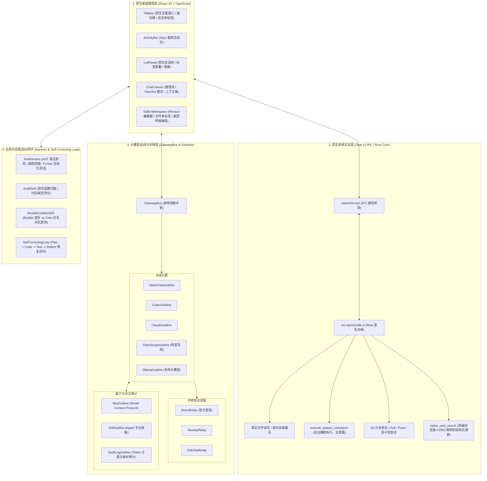

# CodeMind-Hub · 极简暖色原生 AI 编程工作台 (v0.10.0)

> **新一代企业级桌面端 AI 结对编程与智能体协同开发 IDE**  
> 基于 **Tauri v2 + Rust 原生微内核 + React 19 + TypeScript** 打造，深度融合 **GatewayBus 积木式大模型总线**、**Plan/Act 掌控型双模式**、**Git 影子快照秒级回退**、**真实代码知识图谱 (Graph-RAG)** 与 **Harness 自动化治具自愈闭环**。

---

## 🎨 产品设计理念与视觉体系

CodeMind-Hub 采用**暖米白柔和纸质基底**与**低饱和陶土暖橙**的克制配色，专为全天候高强度编码设计，兼顾极致极客质感与视觉舒适度：
- **主背景底色**：`#FAF8F5` (Warm Cream)，消除刺眼冷白强光；
- **工作台表面**：`#F4EFEA` (Warm Soft Ivory)，呈现细腻自然的视觉层级；
- **强调色**：`#D96B27` (Terracotta Orange)，克制点缀于活跃状态、运行按钮与关键操作；
- **代码与终端块**：`#1E1C1A` (Warm Charcoal) 搭配 `#A3E635` 柔和荧光绿；
- **尺寸原则**：控件尺寸严谨克制，杜绝大按钮与冗余卡片网格，留出最大有效代码区。

---

## 🏛️ 系统架构图 (Architecture Overview)



---

## 🌟 核心特性 (Core Features)

### 1. 📋 Plan / Act 双模式切换机制 (对标 Cline / Roo-Code)
- **📋 Plan 模式 (分析规划)**：强制 AI 先进行深度需求分析、代码扫描、架构方案拆解并输出结构化任务卡片，**严格禁止直接写入磁盘或执行破坏性指令**；
- **⚡ Act 模式 (执行落地)**：在方案经过开发者审核同意后，允许智能体执行批量代码替换、文件新建并触发自动化测试。

### 2. ↩️ Git 影子检查点与秒级一键回退 (对标 Aider)
- **写前自动快照**：AI 在执行任何文件修改或批量写入之前，系统底层自动触发 `git stash` 建立 `[CodeMind Checkpoint]` 快照；
- **秒级还原保护**：右侧工作区顶部常驻 **`↩️ 影子回退`** 按钮，若对 AI 产出不满意，单次点击即可瞬间还原工作区到修改前状态，保障项目绝对安全。

### 3. 🎛️ GatewayBus 总线-子线积木式模型网关
- **全厂商适配**：支持 OpenCode、Codex、Claude、阿里百炼 (DashScope)、Ollama 本地大模型；
- **中转协议无缝兼容**：内置 DirectRelay (直连)、NewApiRelay、Sub2ApiRelay 聚合协议；
- **多账号凭据热切换**：单厂商支持配置多组 API Key / 账号池，实时监控配额余量与倒计时重置，故障自动故障转移 (Failover)。

### 4. 🧪 TestHarness 治具与双向钢人自愈闭环
- **AST 语法前检**：写入前进行抽象语法树验证，彻底拦截语法解析错误；
- **双向钢人审查 (Double Iron-Man)**：Builder (建设者) 与 Critic (红军质询者) 进行对抗辩论，针对潜在风险、过度封装或兼容性缺陷质询共识后方可放行；
- **ReAct 自愈闭环**：代码执行如果遇到异常，自动捕获 Traceback 并触发 Reflect 反思再修复，直到 Harness 测试全绿通过。

### 5. 🕸️ 真实工程代码知识图谱 (Obsidian AST Graph-RAG)
- 动态扫描项目 Python / TS / 代码文件 AST 语法树，提取 Class、Function、Import 与调用依赖拓扑；
- 全景交互式 D3.js 力导向画布，在提问时可将关联度最高的代码实体架构摘要精准注入提示词。

---

## 🛠️ 技术栈 (Tech Stack)

| 分层 | 技术选型 | 说明 |
| :--- | :--- | :--- |
| **桌面核心宿主** | **Tauri v2 (Rust)** | 轻量原生内核、无控制台黑框、内存占用极低 (< 80MB) |
| **前端应用层** | **React 19 + TypeScript + Vite 6** | 响应式组件化、极速热重载、完整类型守卫 |
| **样式与组件体系** | **Tailwind CSS + Lucide Icons** | 暖米白 + 陶土橙设计规范，全扁平化极简无冗余卡片 |
| **语言与自动化治具** | **Python 3.12 + PyTest + AnyIO** | TestHarness 测试套件与 AST 语法树分析治具 |
| **图谱与可视化** | **D3.js (Force Directed Simulation)** | AST 实体关系与架构调用图谱渲染 |

---

## 🚀 快速开始 (Quickstart)

### 1. 环境准备
- **Node.js**: `>= 20.0.0` (支持 npm / pnpm)
- **Rust 工具链**: `>= 1.78.0` (`cargo`, `rustc`)
- **Python 环境**: `>= 3.12` (使用 `uv` 极速包管理)

### 2. 克隆与依赖安装
```bash
# 克隆工程
git clone https://github.com/zhangqi77ok-sys/agent-learning.git
cd agent-learning

# 安装前端依赖
npm install
```

### 3. 本地启动开发
```bash
# 启动前端开发调试模式
npm run dev

# 启动 Tauri 原生桌面端全量交互
npm run tauri dev
```

### 4. 生产构建与质量保障
```bash
# 构建前端静态资源 (TypeScript 类型检查 + Vite 优化压缩)
npm run build

# 运行 Tauri 原生桌面端构建
npm run tauri build
```

---

## 📜 研发规约与 SDD + TDD 驱动规范

本项目全面推行 **规范驱动开发 (SDD) + 测试驱动开发 (TDD)**，已在 [`.agents/skills/sdd-tdd-workflow/`](.agents/skills/sdd-tdd-workflow/) 安装强制工作流 Skill，并在 [`AGENTS.md`](AGENTS.md) 中全局生效：
1. **SDD (Spec-Driven)**：编码前必须在回复中先输出接口契约（Spec Contract）与边界设计；
2. **TDD (Test-Driven)**：遵循 **Red (编写前置失败测试) → Green (编写最简通过代码) → Refactor (双向钢人审查)** 节奏；
3. **架构设计规范**：详见全景架构文档 [`ARCHITECTURE.md`](ARCHITECTURE.md)；
4. **产品需求与竞品分析**：详见详细产品规约 [`PRODUCT_REQUIREMENTS_DOCUMENT.md`](PRODUCT_REQUIREMENTS_DOCUMENT.md)；
5. **专精 Skill 矩阵**：内置 `product-manager`、`ui-ux-designer`、`frontend-architect`、`rust-core-engineer`、`python-harness-engineer`。

---

## 📄 开源许可 (License)

本项目基于 [MIT License](LICENSE) 许可开源。欢迎提交 Issue 与 Pull Request，携手共建极致体验的现代化自主编程工作台！
