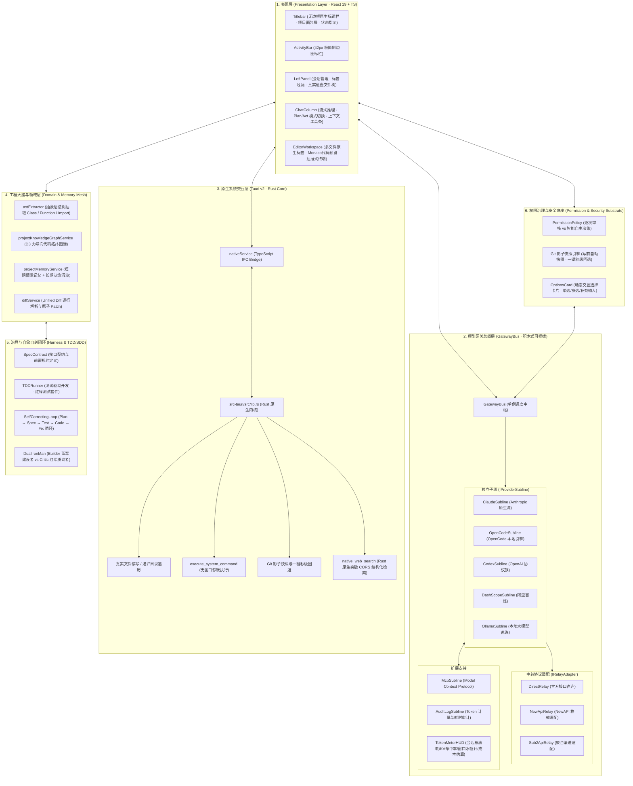
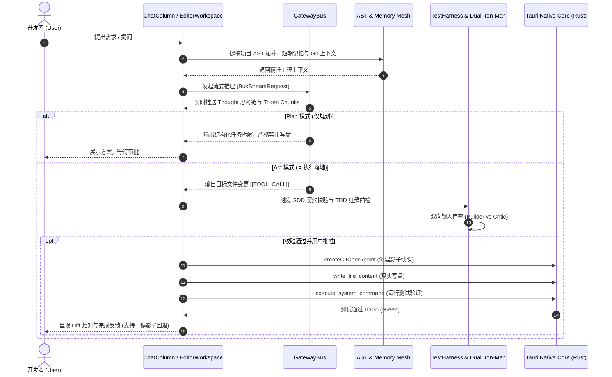
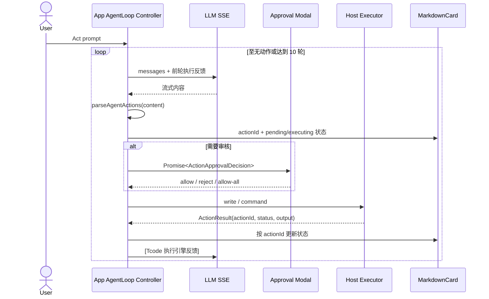
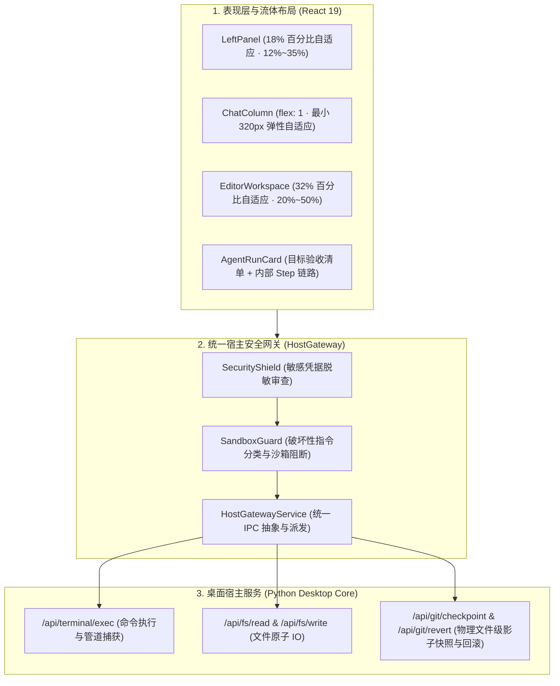

# Tcode 全景架构设计规范 (ARCHITECTURE.md)

> **设计哲学**：单一主轴、高度解耦、积木思想、Harness 治具思想、ReAct 循环思想，拒绝过度封装。  
> 基于 **Tauri v2 (Rust 原生内核) + React 19 + TypeScript + GatewayBus 积木总线**。

---

## 🏛️ 一、分层解耦架构全景图 (Layered Architecture)



---

## 🔄 二、ReAct 智能体与自愈闭环数据流 (Dataflow Sequence)



---

## 📐 三、模块解耦规约 (Decoupling Principles)

1. **零循环依赖**：`services/bus/` 绝不反向依赖 UI 组件，仅通过纯接口（`IProviderSubline`, `BusStreamRequest`, `BusStreamCallbacks`）通信；
2. **单一职责 (SRP)**：每个厂商子线独立文件（`ClaudeSubline.ts`, `OpenCodeSubline.ts` 等），新增厂商只需实现标准子线接口注册至 `GatewayBus`，无需修改任何 UI 代码；
3. **安全第一 (Safety First)**：所有系统命令与文件写操作均通过 Tauri IPC 约束并在执行前自动触发 Git 影子快照，确保随时可秒级还原。

---

## 8. v1.1.9 架构演进与容灾持久化子系统

### 8.1 Dual-Layer Fail-Safe Storage Architecture (双层容灾存储架构)

```
┌────────────────────────────────────────────────────────┐
│               前端 React 状态层 (State Layer)           │
└───────────────┬────────────────────────┬───────────────┘
                │                        │
                ▼                        ▼
     ┌──────────────────────┐ ┌──────────────────────────────────────┐
     │ Layer 1: WebView2    │ │ Layer 2: 物理磁盘 JSON 引擎           │
     │ Persistent Profile   │ │ (POST /api/storage)                  │
     │ (%LOCALAPPDATA%/...) │ │ (%LOCALAPPDATA%/Tcode/storage)│
     └──────────────────────┘ └──────────────────┬───────────────────┘
                                                 │
                                                 ▼
                                     ┌───────────────────────┐
                                     │ codemind_sessions.json│
                                     │ session_messages.json │
                                     │ codemind_projects.json│
                                     └───────────────────────┘
```

### 8.2 Prompt Execution Queue Pipeline (问答调度队列流水线)

```
[用户 Prompt 提交] ──▶ 是否正在流式生成?
                             ├── 否 ──▶ 立即启动 SSE 真流式传输 ──▶ 右下角切换为转动红圆圈 (支持随时打断)
                             └── 是 ──▶ 压入 PromptQueue 调度队列
                                             │
                                             ├── 支持 [⚡ 顶替当前] (打断当前 + 抢占执行)
                                             ├── 支持 [✏️ 编辑] (就地行内修改)
                                             ├── 支持 [🔼 / 🔽] (调整排队优先级)
                                             ├── 支持 [🗑️ 撤回] (注销移出队列)
                                             └── 当前回答完成后自动 FIFO 顺延调用
```


---

## 9. Agent Loop Controller：可观察的 Think → Execute → Observe → Continue

`App` 是当前原型的编排器；`ChatColumn` 仅负责承载审批模态框与渲染消息，`MarkdownCard` 是无副作用展示层。解析、授权判定、执行反馈和结果查找收敛在 `src/services/agentLoop.ts`，防止“视觉上是动作而执行器不识别”的双重语义。



### 9.1 前端契约
- `AgentAction`：`id`、`type`、`target`、`code`、`isHighRisk`；由围栏块顺序和内容生成确定性标识；
- `ActionResult`：追加 `actionId`，与动作一对一关联，状态覆盖 `pending | executing | success | failed | rejected`；
- `shouldRequireActionApproval(policy, action, allowLowRiskInSession)`：唯一权限判定入口；`allow-all` 不绕过高风险审核；
- `formatExecutionFeedback(actions, results)`：仅输出执行事实，截断宿主输出，供下一轮决策；
- SSE 流使用显式完成标识与尾缓冲解析；对话历史由局部快照维护，禁止借 React `setState` 回读历史。

### 9.2 组件边界
`ActionApprovalModal` 只产生决策，不执行宿主请求；`App` 将其转化为 Promise 并串行执行动作。`MarkdownCard` 通过 `actionId` 查找结果，只提供复制、代码展开和文件定位。`ChatColumn` 不维护第二套动作队列、自动授权或执行回调。

### 9.3 测试治具
纯函数测试覆盖围栏解析、多动作稳定标识、策略、反馈及状态匹配；其中必须包含空/未闭合代码块、拒绝、失败、风险自适应和会话授权不跨越高风险动作。SSE/宿主集成测试属于下一阶段，须以 mock stream 覆盖 `[DONE]` 和尾缓冲行为。


---

## 10. Windows Installer Pipeline（当前 PyInstaller 宿主）

构建入口为根 `build_installer.py` 与 `npm run build:installer`。该入口先构建和验证 `prototype`，再将 `prototype/dist` 作为数据资源嵌入窗口化 Python 宿主 `Tcode.exe`，最后将核心 EXE 嵌入窗口化单文件安装向导 `Tcode-Setup.exe`。

安装后宿主固定监听 `127.0.0.1:8010`：`/health` 供进程探活，`/` 提供已嵌入的静态前端。构建和验证都使用当前源码，绝不拷贝 `release/` 内的历史二进制。Tauri 链路保留为后续主轴迁移目标；在其完整构建脚本落地前，当前受支持的 Windows 安装器采用这一可复现的 Python 宿主链路。


---

## 🏛️ 八、宿主网关与三栏百分比流体架构 (HostGateway & Layout Engine)



### 核心架构原则
1. **单一入口 openFile**：全链路收敛为 `handleOpenFile(path, fileName, line)`；
2. **百分比流体拖拽**：基于全局 `PointerEvent` 监听与百分比弹性分配，双击复位；
3. **真实物理闭环**：杜绝模拟 Toast，回滚与读写直接作用于磁盘与 Git 检查点。
