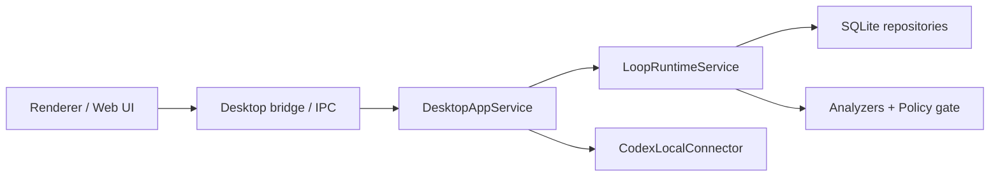

# Desktop Local Service v1

## Purpose

The desktop app needs a single local service boundary before real Electron IPC is added. This boundary keeps renderer code away from SQLite details and lets Web UI, IPC handlers, and smoke tests share the same product operations.

## Scope

`DesktopAppService` wraps the local SQLite store, loop runtime, policy catalog, and Codex session discovery.

v1 operations:

- Create a task and its first loop run in one call.
- List tasks with their latest loop run.
- Discover local Codex sessions.
- Bind a discovered session to a loop run.
- Persist discovered session `sourcePath` for later transcript ingestion.
- Ingest session events from the bound Codex JSONL source.
- Append session events for analysis.
- Run loop analysis and read the loop snapshot.
- List pending manual reviews.

## Data Flow

## Design Rules

- The service is orchestration only; domain decisions stay in `packages/core`, `packages/analyzers`, and `packages/policy`.
- The default database path is local to the user's home directory, but tests can inject `:memory:`.
- Review gates are visible in snapshots so the UI can show why an action cannot auto-run.
- Session event ingestion is connector-owned; the service validates LoopRun/session binding and persists normalized events.
- Repeated ingestion is idempotent. Duplicate events are skipped, and `importedCount` reports only newly stored events.
- Actual auto-resume transport is out of scope for this slice.
