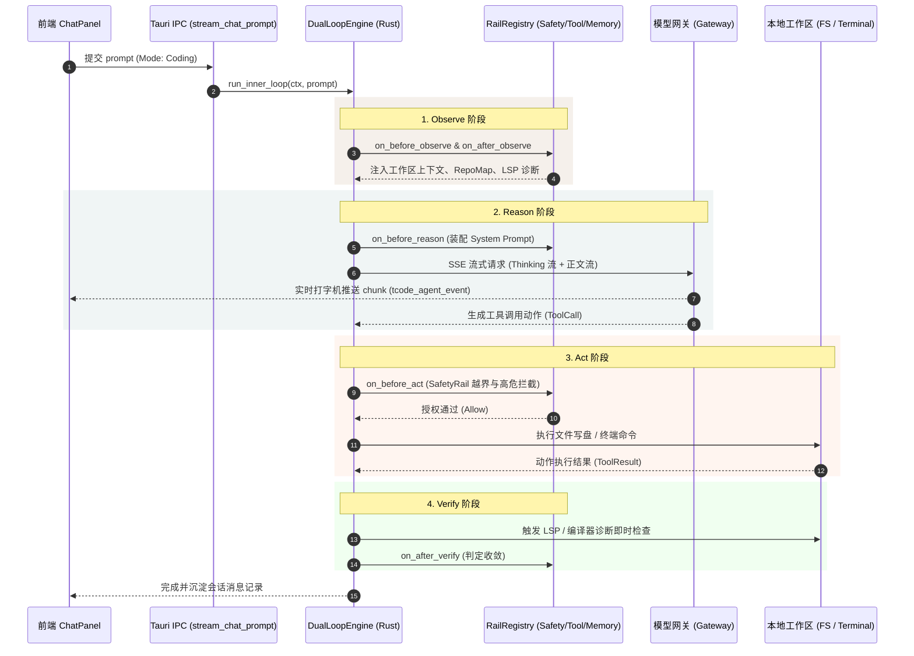

# 04 - Tcode 执行模式拓扑与双环/SwarmFlow 内部逻辑设计

> **归档编号**：KNOW-04  
> **关联规范**：`AGENTS.md`【铁律 6】、`PRD_TCODE_SWARM_FLOW_ARCHITECTURE.md`、`WP-B 模式收敛设计`  
> **核心领域**：智能体执行内核 / 执行拓扑状态机 / 算子流与双环管线

---

## ① 知识点与背景：三维正交架构澄清 (Context & Problem Statement)

在前期调研中，容易将行业其他工具（如 Roo Code）的“角色枚举（Ask / Architect / Code / Test）”与“执行模式”混淆。
在 Tcode 的顶层设计中，系统严格遵循 **三维正交解耦原则 (Three Orthogonal Dimensions)**：

```text
┌────────────────────────────────────────────────────────────────────────────────────────┐
│                               Tcode 三维正交智能体治理架构                            │
├────────────────────────────────┬───────────────────────────────────────────────────────┤
│ 维度 1: 执行拓扑范式            │ • ⚡ Coding Loop (单 Agent 极速执行双环)               │
│ (Execution Topology Mode)      │ • ✨ SwarmFlow (多 Agent 7 算子流编排协同)              │
├────────────────────────────────┼───────────────────────────────────────────────────────┤
│ 维度 2: 专职角色与技能          │ • Agent Skills 引擎 (通过 /review, /test, /sec 动态挂载)│
│ (Agent Skills & Prompt Tuning) │ • 动态决定模型的 System Prompt 侧重点与专长            │
├────────────────────────────────┼───────────────────────────────────────────────────────┤
│ 维度 3: 行为安全与门禁策略      │ • SafetyRail / Permission Policy (Plan / Act / Gate)   │
│ (Rails & Permission Model)     │ • 物理控制只读(Read-Only)、高危审批(Ask)、阻断(Deny)   │
└────────────────────────────────┴───────────────────────────────────────────────────────┘
```

因此，输入框底部的模式切换，本质上是在切换 **智能体的执行拓扑范式（单智能体闭环 vs 多智能体竞争仲裁）**，而非仅仅切换一段提示词。

---

## ② 内部核心逻辑与数据流向 (Internal Logic & Data Flow)

### 1. 模式 A：⚡ Coding Loop（单智能体双环极速执行态）

适用于日常开发、Bug 快速修复、代码内联补全与针对性单任务执行。



---

### 2. 模式 B：✨ SwarmFlow（多智能体 7 算子编排与仲裁态）

适用于复杂大型重构、跨模块方案设计、方案多路 PK、高风险高价值的核心模块改造。

```text
  用户输入 (Prompt)
         │
         ▼
 ┌───────────────┐
 │ 1. budget()   │ 检查 Token 预算与并发配额，自适应决定 Worker 分支数 (Fan-out N=3)
 └───────┬───────┘
         │
         ▼
 ┌───────────────┐
 │ 2. parallel() │ 并发启动 Worker-A, Worker-B, Worker-C 分头设计候选方案 (Barrier 同步)
 └───────┬───────┘
         │
         ▼
 ┌───────────────┐
 │ 3. compact()  │ 过滤空结果与超时失败分支，提取纯净候选方案集
 └───────┬───────┘
         │
         ▼
 ┌───────────────┐
 │ 4. pipeline() │ 流式送入评审员 (Reviewer)，根据语法正确性、单测通过率独立打分
 └───────┬───────┘
         │
         ▼
 ┌──────────────────┐
 │ 5. agent_session()│ 有状态仲裁者 (Arbiter) 综合评审得分与代码高内聚度，裁决最优胜出候选
 └───────┬──────────┘
         │
    ┌────┴────────────────────────┐
    │ 置信度 >= 80% ?              │
    ├──────────────┬──────────────┤
    │ [YES]        │ [NO]         │
    ▼              ▼              ▼
┌───────────┐ ┌───────────────┐
│ 7. return │ │ 6. human()    │ 挂起任务并弹出方案终审卡，由人类开发者最终拍板
└─────┬─────┘ └───────┬───────┘
      │               │
      └───────┬───────┘
              ▼
    推送到前端 Monaco Diff 工作台呈现
```

---

## ③ 前端状态机与 UI 交互收敛方案 (Frontend State Machine & UI Wiring)

### 1. 废弃割裂的独立状态，收敛至单状态源
废弃 `isSwarmMode: boolean` 与静态文本的割裂排版，在 Zustand Store（`useWorkspaceStore` 或新建 `useExecutionModeStore`）中统一管理：

```typescript
export type ExecutionMode = 'coding' | 'swarm';

export interface ExecutionModeState {
  mode: ExecutionMode;
  swarmBudgetTokens: number;
  setMode: (mode: ExecutionMode) => void;
  setSwarmBudgetTokens: (budget: number) => void;
}
```

### 2. 交互胶囊形态（分段选择器 Segmented Control）
在 [`src/components/chat/ChatPanel.tsx`](file:///e:/pro/agent-learning/src/components/chat/ChatPanel.tsx) 输入框工具栏左下角：
- **态 1：⚡ 极速编码 (Coding)**：
  - 高亮显示浅米底白卡；
  - 输入框 Placeholder 自动变为：`"输入日常编程需求，由单 Agent 极速执行内外双环 (Enter 发送)..."`
- **态 2：✨ SwarmFlow 编排 (Swarm)**：
  - 高亮显示陶土暖橙深色徽标；
  - 输入框上方滑出轻量级 Token 预算条（`预算: 25k tokens · 3 Workers 并行`）；
  - 输入框 Placeholder 自动变为：`"输入大型重构或多任务指令，将通过 SwarmFlow 算子流并行竞标与仲裁..."`

### 3. 全局键盘快捷键响应
- `Alt + 1`：秒切 **⚡ 极速编码模式**
- `Alt + 2`：秒切 **✨ SwarmFlow 算子编排模式**

---

## ④ 后端 IPC 契约与分发器设计 (Backend IPC Contract)

在 `src-tauri/src/ipc/mod.rs` 中提供统一的分发入口，确保数据记录与 Rail 规则完全一致：

```rust
#[derive(Debug, Clone, Serialize, Deserialize)]
#[serde(rename_all = "snake_case")]
pub enum ExecutionTopology {
    Coding,
    Swarm { budget_tokens: u64 },
}

#[tauri::command]
pub async fn dispatch_agent_task(
    app: AppHandle,
    state: State<'_, AppState>,
    session_id: String,
    workspace_dir: String,
    prompt: String,
    topology: ExecutionTopology,
) -> Result<(), String> {
    match topology {
        ExecutionTopology::Coding => {
            // 执行单智能体流式双环
            stream_chat_prompt(app, state, session_id, workspace_dir, prompt).await
        }
        ExecutionTopology::Swarm { budget_tokens } => {
            // 执行 SwarmFlow 7 算子编排
            run_swarm_flow_task(app, state, session_id, prompt, budget_tokens).await
        }
    }
}
```

---

## ⑤ 总结与最佳实践 (Best Practices)

1. **避免概念打架**：
   - 模式（Mode）决定**“几个人怎么干”**（拓扑架构）；
   - 技能（Skill）决定**“具体干什么”**（专精提示词与工具）；
   - 门禁（Rail / Gate）决定**“什么不能干”**（安全边界）。
2. **保持 Fail-Closed 与干净空状态**：
   - 无论处于何种模式，当模型调用超时或出错时直接暴露真实错误，严禁以伪造的候选方案充当正常返回。
