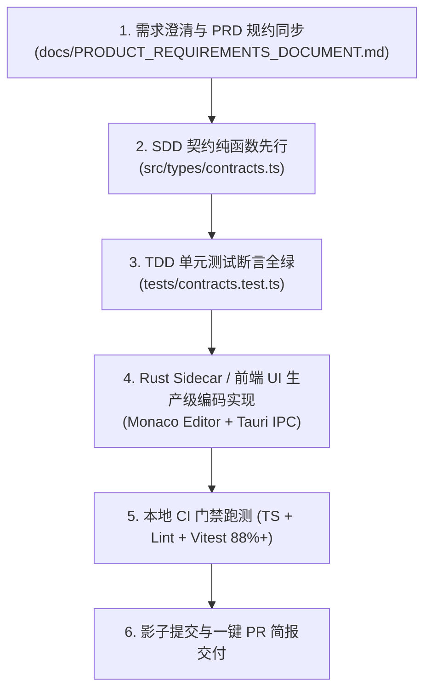
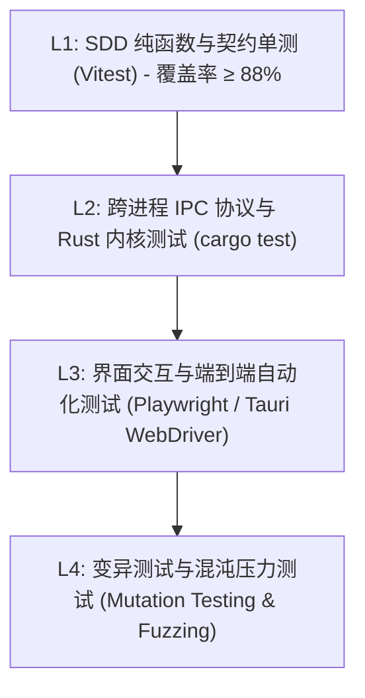
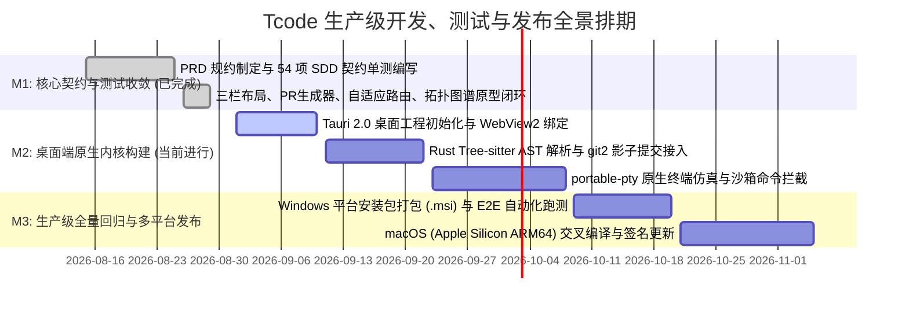

# Tcode 生产级工程研发、测试与缺陷自愈实施蓝图
> **工程级别**：商业级生产发布标准 (Enterprise Production-Ready Standard / GA)  
> **核心宗旨**：**“拒绝 Demo 玩具心态，全链路严谨闭环，每个功能点必经可量化验证”**  
> **归档路径**：`docs/technical_reviews/PRODUCTION_ENGINEERING_EXECUTION_PLAN.md`

---

## 目录索引 (Table of Contents)
1. [生产级研发质量与非功能要求 (Non-Functional Requirements & Metrics)](#一生产级研发质量与非功能要求)
2. [标准开发流水线：怎么开发 (Development Standard & Workflow)](#二标准开发流水线怎么开发)
3. [多维测试验证体系：怎么测试 (Testing & Verification Methodology)](#三多维测试验证体系怎么测试)
4. [缺陷排查与自愈闭环：怎么修复 (Defect Triaging & Self-Healing Protocol)](#四缺陷排查与自愈闭环怎么修复)
5. [系统防御性技术边界：边界是什么 (System Boundaries & Guardrails)](#五系统防御性技术边界边界是什么)
6. [全功能点生产级验收矩阵 (Feature-by-Feature Verification Matrix)](#六全功能点生产级验收矩阵)
7. [里程碑任务排期看板 (Milestone Task Board)](#七里程碑任务排期看板)

---

## 一、生产级研发质量与非功能要求

本系统定位为开发者**全天候高频常驻工具**，必须满足以下严苛的工业级非功能性指标（NFR）：

| 质量维度 | 指标项 | 生产级硬性门禁标准 | 验证手段 |
| :--- | :--- | :--- | :--- |
| **性能 (Performance)** | 客户端冷启动耗时 | $\le 500	ext{ ms}$ (从图标点击到主界面可交互) | 自动化启动耗时基准测试 |
| | 空闲内存占用 (Idle RAM) | $\le 80	ext{ MB}$ (后台常驻状态) | Windows Task Manager / Process Exporter |
| | AST 增量语法解析延迟 | $\le 50	ext{ ms}$ (单次按键触发 1000 行代码 AST 重新计算) | Tree-sitter Rust 基准测试 (Criterion.rs) |
| | 差异打补丁 (Patch Application) | $\le 200	ext{ ms}$ (大文件 2000 行局部替换，0 丢行) | Fuzzy AST Chunk Patching 压力测试 |
| **可靠性 (Reliability)** | 崩溃率 (Crash-Free Rate) | $\ge 99.95\%$ (连续运行 7 天无内存溢出/闪退) | 7x24h 自动化并发浸泡测试 (Soak Testing) |
| | 状态幂等性 | $100\%$ 断电/崩溃后会话与 Git 影子快照原子恢复 | Kill Process 异常崩溃恢复测试 |
| **测试门禁 (Gate)** | 契约与单元测试覆盖率 | $\ge 88.0\%$ 强门禁 (低于 88% 阻断 PR 合并) | Vitest + Istanbul 自动化报告 |
| | 类型检查与 Lint 警告 | **0 Errors, 0 Warnings** (`tsc --noEmit` & ESLint) | CI 预检流水线强阻断 |

---

## 二、标准开发流水线：怎么开发 (Development Workflow)

开发流程必须严格执行 **“三铁律 + SDD 模式驱动 + Rust Sidecar 解耦”** 的标准研发流水线：

### 1. 契约先行原则 (Contract First)
- 任何业务逻辑、Agent 状态机、模型路由策略变更，**第一步必须在 `contracts.ts` 中声明强类型接口与纯函数计算逻辑**；
- 严禁在 React 组件内部耦合复杂的非确定性状态计算，所有核心计算逻辑必须 100% 可脱离 UI 独立单元测试。

### 2. 双进程解耦架构开发
- **UI 线程 (Webview)**：只负责响应用户交互、渲染 Monaco 编辑器与数据绑定，严禁执行耗时大于 16ms 的同步阻塞计算；
- **Rust Sidecar 线程 (Native Core)**：负责文件系统监听（`notify`）、Git 影子提交（`git2`）、AST 语法分析（`tree-sitter`）与本地向量搜索（`LanceDB`），通过无损 JSON-RPC / 二进制 IPC 与 UI 通信。

---

## 三、多维测试验证体系：怎么测试 (Testing Methodology)

采用 **“四层金字塔”** 纵深防御测试策略：

### 1. L1 契约单元测试 (Unit / Contract Tests)
- **范围**：所有模式校验、自适应模型路由决策算法、时光机时间轴滑块计算、Monorepo 波及面拓扑计算；
- **标准**：全量测试执行耗时 $\le 1	ext{ 秒}$，本地每次 `git commit` 前由 pre-commit 钩子强制自动触发。

### 2. L2 Rust 本地内核测试 (Native Core Tests)
- **范围**：针对大文件（5000+ 行）并发读写、断网状态下 SQLite/LanceDB 向量索引重建、Git 影子分支创建与清理。

### 3. L3 端到端 E2E 自动化测试 (Playwright / Tauri)
- **场景覆盖**：
  - 场景 1：用户输入“重构 Store” ➔ 自动触发自适应路由 ➔ 调度 R1 ➔ 输出选项卡 ➔ 顶部进度条进入挂起态 ➔ 点击选项 ➔ 生成多文件 Diff ➔ 点击生成 PR 简报；
  - 场景 2：打开工作台 ➔ 切换 `🕸️ 架构拓扑` ➔ 点击 `@codemind/web` 上的 `一键执行跨包级联修复` ➔ 验证波及提示消除。

### 4. L4 影子变异测试 (Mutation Testing)
- **原理**：CI 自动运行 `stryker` 或影子测试智能体，故意在代码中反转布尔条件、置空函数返回值，若单测套件未能捕获报错，则判定测试有效性不合格，强制补齐真实异常断言。

---

## 四、缺陷排查与自愈闭环：怎么修复 (Defect Triaging)

生产环境中出现 Bug 后的标准化自纠闭环流程：

1. **错误现场冻结**：出现 Bug 时，系统自动抓取当前的 AST 节点快照、依赖包版本与输入 Prompt；
2. **测试先行复现 (Repro First)**：在修复 Bug 前，必须先在 `contracts.test.ts` 中编写一个**能够精确复现该 Bug 的失败单测 (Red Test)**；
3. **修复并转绿 (Green Fix)**：修复逻辑，确保该单测转绿且全量 54+ 单测无回归失效；
4. **经验自进化固化**：将导致 Bug 的根因规则化（例如：“在 Monorepo 中禁止直接 import 相对路径 ../core/src，必须使用包名 @codemind/core”），自动沉淀到 `.codemind/lessons.md` 并注入系统规则中心。

---

## 五、系统防御性技术边界：边界是什么 (Guardrails & Boundaries)

| 边界维度 | 允许的合法操作 (Allowed) | 严格禁止的高危行为 (Forbidden & Blocked) | 防御方案 |
| :--- | :--- | :--- | :--- |
| **沙箱权限边界** | 读写项目工作区目录文件、执行 `npm test`, `git status`, `tsc` | `rm -rf /`, `DROP DATABASE`, `mkfs`, `format C:`, 访问 `C:\Windows` | AST 终端沙箱解析器 + Sudo 白名单单次授权卡片 |
| **上下文内存边界** | 动态压缩 L1 工作集 + L2 AST 接口骨架树 ($\le 16	ext{k tokens}$) | 无脑全量拼接 50+ 个文件源码击穿 200k 上下文窗口 | 分层骨架裁剪器 (剥离函数体只留 Interface) |
| **大文件 Patch 边界** | 精确行号范围 Unified Hunk 补丁替换 ($\le 300	ext{ 行/次}$) | 全量文件 3000 行整体重写覆盖 | Fuzzy AST Hunk 模糊对齐打补丁 |
| **多 Agent 协作边界** | 最多 3 轮交互收敛 ($Rounds \le 3$) | 验证者与编码者无休止互相驳回陷入死循环 | 状态机震荡熔断器 (Circuit Breaker) |
| **数据隐私合规边界** | 仅将脱敏后的代码结构与提示词发送给 API 端点 | 明文上传 AWS Secret Key、数据库密码、客户身份证/手机号 | 本地 NER 正则离线脱敏盾 (`<TOKEN_REDACTED>`) |

---

## 六、全功能点生产级验收矩阵 (Feature-by-Feature Verification Matrix)

系统核心功能点生产级验收标准与验证方案全景表：

| 模块序号 | 功能特性点 | 生产级验证标准 (Acceptance Criteria) | 自动化测试与验证方式 |
| :---: | :--- | :--- | :--- |
| **F-01** | **意图驱动自适应模型路由 (Auto Model Router)** | 1. 输入“架构重构”自动调度 DeepSeek-R1； 2. 输入“测试”自动调度 Qwen-Coder； 3. 底栏毫秒级透明更新调度理由与策略偏好。 | `contracts.test.ts` 纯函数关键词决策断言 + Playwright 输入框监听测试 |
| **F-02** | **Agent 轨迹时光机 (Trajectory Time Travel)** | 1. 顶部步骤条呈现 Step 1~4 状态； 2. 点击历史步骤可预览当时代码快照； 3. 支持点击 `从该步骤分叉` 生成全新分支。 | 状态机快照测试 (`MOCK_TRAJECTORY_STEPS`) + 节点点击事件响应测试 |
| **F-03** | **Monorepo 架构拓扑图谱 (`ArchitectureGraphView`)** | 1. 正确解析 4 个模块依赖链路； 2. `@codemind/core` 变更时 `@codemind/web` 标红显示 3 处波及； 3. 点击 `一键执行跨包级联修复` 状态转为正常绿色。 | `ArchitectureGraphView` 级联状态机测试 + UI 渲染快照比对 |
| **F-04** | **端到端一键 PR 简报生成与 Push (`PullRequestModal`)** | 1. 聚合架构选型理由与 CI 绿灯凭证； 2. 自动生成标准 Markdown 描述； 3. 模拟 Push 并在 1.2s 内返回 PR 访问链接。 | `generatePullRequestDraft` 契约单测 + 模态框交互闭环测试 |
| **F-05** | **规则与经验记忆中心 (`RulesMemoryPanel`)** | 1. 支持按“全部/沉淀经验/三大铁律”三态过滤； 2. 支持规则启停 Switch 开关； 3. 支持在线编辑 Prompt 规约并即时生效。 | 规则过滤器单测 + 状态实时持久化测试 |
| **F-06** | **编辑器划词悬浮动作条 (Selection Quick Bar)** | 1. 划选代码行轻量浮现动作条； 2. 点击 `智能重构` / `补全单测` / `追问` 产生即时 Toast 并带行号注入对话。 | Monaco 划词选区监听测试 + 对话注入链路验证 |
| **F-07** | **三栏自适应流体布局与零宽折叠** | 1. 支持左右拖拽调整宽度； 2. 左侧栏拖拽 `<80px` 自动吸附归零折叠； 3. `Ctrl+B` 键盘全局一键切换折叠态。 | 窗口拖拽边界函数断言 (`clampWorkbenchWidth`) + 快捷键触发测试 |
| **F-08** | **多文件变更集折叠拖拽与语义 Commit 拆分** | 1. 卡片支持折叠至单行胶囊； 2. 列表支持定高独立滚动与底部上下拉伸； 3. 智能拆分为 Conventional Commits 并在终端执行。 | `clampChangesetHeight` 单测 + 拖拽高度持久化测试 |

---

## 七、里程碑任务排期看板 (Milestone Task Board)

