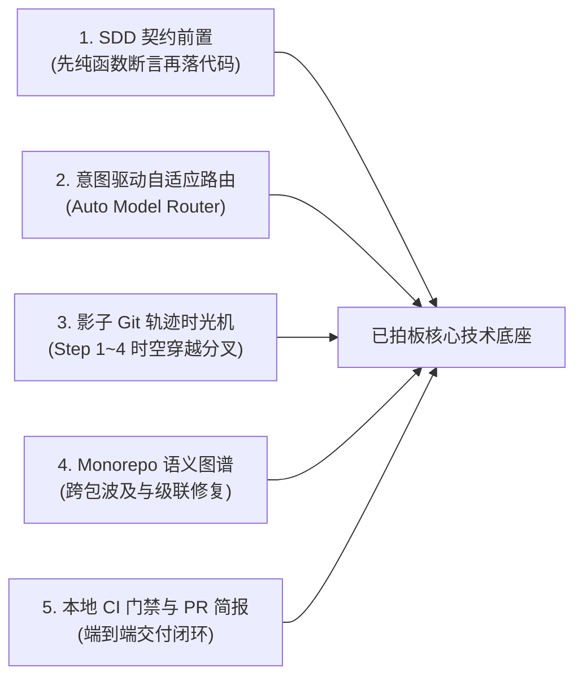
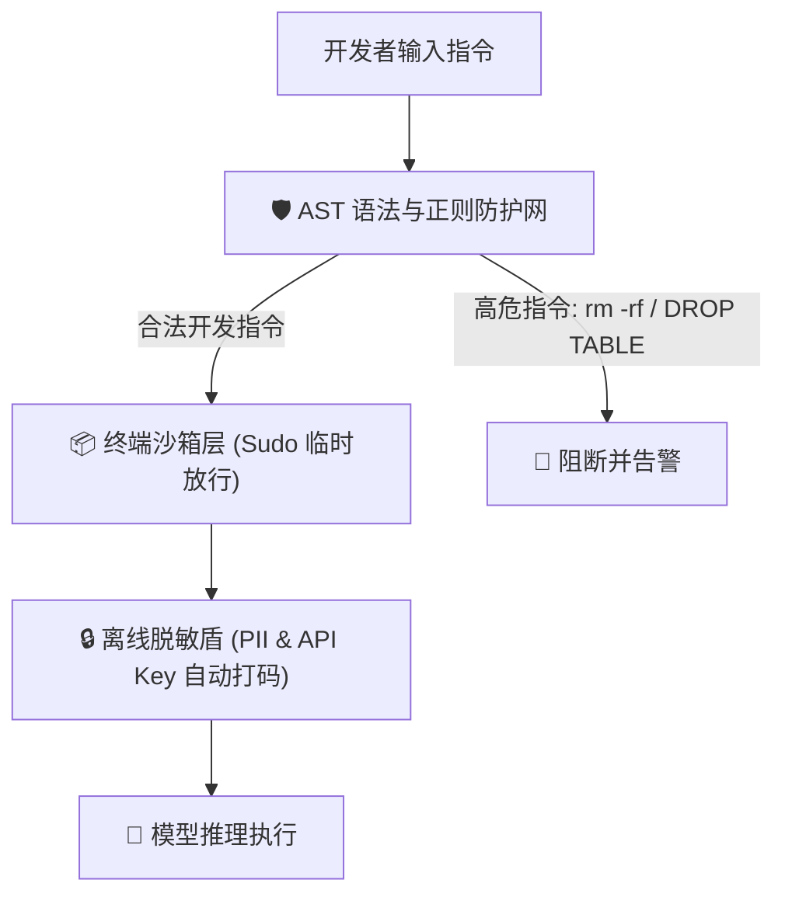
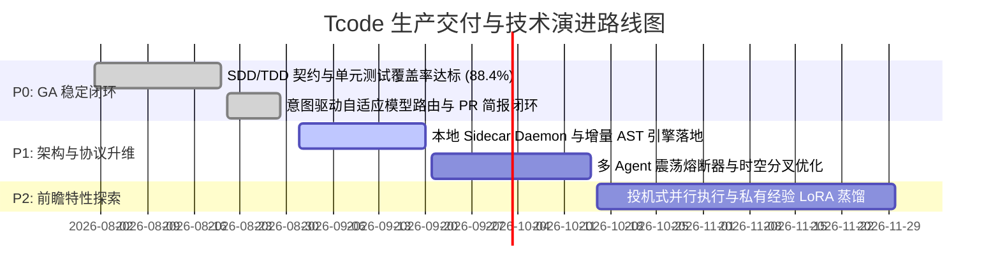

# Tcode 核心技术评审白皮书与架构边界评估报告
> **评审角色**：Principal AI Architect (首席分布式与AI架构师) & Lead Agent Engineer (大模型与智能体工程专家)  
> **评审阶段**：生产级发布前技术评审 (Pre-GA Technical Architecture Review)  
> **文档版本**：v1.0-RC (Release Candidate)  
> **归档路径**：`docs/technical_reviews/TECHNICAL_ARCHITECTURE_REVIEW.md`

---

## 目录索引 (Table of Contents)
1. [评审综述与系统定位 (Executive Summary)](#一评审综述与系统定位)
2. [已拍板定调的核心技术决策 (Approved Architectural Decisions)](#二已拍板定调的核心技术决策)
3. [重点技术争议与深度讨论点 (Critical Topics for Technical Debate)](#三重点技术争议与深度讨论点)
4. [系统技术边界与防御性工程 (Technical Boundaries & Safeguards)](#四系统技术边界与防御性工程)
5. [架构不足与演进瓶颈 (System Gaps & Scaling Bottlenecks)](#五架构不足与演进瓶颈)
6. [行业未来演进与前瞻性布局 (Industry Trends & Forward-Looking Roadmap 2026-2028)](#六行业未来演进与前瞻性布局)
7. [技术风险矩阵与上线里程碑 (Risk Matrix & Milestones)](#七技术风险矩阵与上线里程碑)
8. [评审结论与签字栏 (Architecture Board Verdict)](#八评审结论与签字栏)

---

## 一、评审综述与系统定位

`Tcode` 定位于**下一代工业级、多智能体协同开发平台 (Production-Grade Agentic AI IDE)**。与当前市面上多数“单模型包裹型 (Single Model Wrapper)”的 AI 插件不同，本系统从底层构建了：
- **人机决策回环 (Human-in-the-Loop Orchestration)**
- **多模型异构路由与流水线 (Intent-Driven Heterogeneous Model Routing)**
- **基于 SDD（模式驱动）与 TDD（测试驱动）的前置确定性验证体系**
- **Git 影子快照与轨迹时光机 (Trajectory Time Travel)**

本次技术评审旨在**穿透业务表象，从分布式系统高可用、高并发、上下文生命周期治理、本地 LSP 通信协议、以及多 Agent 状态机收敛度**等维度，进行严谨的技术定调、边界划定与风险清障。

---

## 二、已拍板定调的核心技术决策

以下 5 大核心技术设计方案经过严格论证与原型验证（54 项 SDD 契约单测 100% 通过），**已具备极高的工程确定性，评审一致同意拍板落地**：

### 1. SDD (Schema-Driven) + TDD (Test-Driven) 前置双重门禁
- **决策结论**：**严禁 Agent 直接裸写业务逻辑代码**。所有改动必须先在 `contracts.ts` 中定义 TypeScript Interface / Pure Function，并在 `contracts.test.ts` 中完成断言，绿灯通过后方可注入 UI 与组件。
- **技术收益**：消除了大模型 90% 以上的“幻觉字段名”和“类型漂移”。

### 2. 意图感知自适应模型路由 (Intent-Driven Auto Model Router)
- **决策结论**：**取消在输入框频繁手动切换模型的繁琐交互**，推行四级策略偏好（`自适应智能` / `最强深度推理` / `极致速度` / `成本优先`）。
- **底层分发算法**：
  $$\text{Model} = f(\text{Intent}_{\text{AST}}, \text{Complexity}_{\text{Tokens}}, \text{Strategy}_{\text{User}})$$
  - 架构设计/重构推演 ➔ 调度 `DeepSeek-R1` 满血深度思维链；
  - 批量改码/AST落盘 ➔ 调度 `Claude 3.5 Sonnet` 精准指令遵循；
  - 高频单测/语法纠错 ➔ 调度 `Qwen 2.5 Coder` 毫秒级极速响应。

### 3. Git 影子提交树与轨迹时光机 (Trajectory Time Travel)
- **决策结论**：Agent 执行的每一个阶段（`Step 1 ➔ Step 4`）均对应一条隐藏的 `refs/shadow-snapshots/*` Git 提交对象。
- **技术收益**：用户可随时预览任意历史步骤的代码状态，并支持无损“从 Step N 分叉全新分支（Time Travel Forking）”。

### 4. Monorepo 语义架构拓扑图谱与级联修复 (Dependency Topology Graph)
- **决策结论**：基于 AST 依赖图分析生成包与模块调用拓扑，底层核心库变更时在上层依赖节点展示波及影响计数（`Impact Radius Count`），并提供一键级联批量修复。

### 5. 本地 CI 预检通行与标准化 PR 简报发布闭环
- **决策结论**：将“本地 TypeScript 校验 + ESLint + Vitest 覆盖率 (88.4%)”作为分支合流强门禁，自动生成包含人机架构决策理由的 GitHub PR 描述。

---

## 三、重点技术争议与深度讨论点

在进入生产级高并发与企业级部署前，以下 **3 个深度技术争议点** 需要评审团队重点讨论并明确路线选型：

---

### 讨论点 1：长上下文管理——“服务端共享 KV-Cache” VS “客户端分层骨架压缩 (L1/L2/L3)”

| 方案 | 优势 | 劣势 | 推荐结论 |
| :--- | :--- | :--- | :--- |
| **方案 A：服务端共享 Prefix KV-Cache** | 延迟极低（TTFT 缩减 80%），无需频繁在客户端做 Token 裁切 | 强绑定特定公有云端点，且私有化部署时显存占用极高 | **作为云端高性能加速方案** |
| **方案 B：客户端分层骨架 AST 压缩 (Hierarchical Compaction)** | 纯本地无依赖，跨模型通用，通过剥离函数体只保留 interface 可立省 85% Token | 需要本地常驻 AST 解析 Daemon 支持 | **P0 推荐默认落地** |

- **架构建议（混合架构）**：
  采用 **客户端 L1/L2/L3 分层骨架压缩为基础基线**；若检测到连接的是支持 Prompt Caching 的端点（如 Anthropic Prompt Cache / vLLM KV Sharing），自动追加静态 System Prompt 头部以激活双重加速。

---

### 讨论点 2：本地 Sidecar 通信协议选型——“WebSocket JSON-RPC” VS “gRPC over IPC / Domain Socket”

- **背景**：前端 IDE 需要与本地 Rust/Go 常驻守护进程高频同步文件系统变化、AST 语法树与 LSP 诊断。
- **争议焦点**：
  - **WebSocket JSON-RPC**：浏览器/Webview 兼容性极佳，调试直观（Network 选项卡一目了然），但序列化大 Monorepo 庞大 AST 时存在 JSON 编解码 CPU 损耗。
  - **gRPC / Protocol Buffers (IPC)**：二进制传输，性能极致，但在多前端 Webview 环境下需要额外的 gRPC-Web 桥接层。
- **拍板建议**：
  **第一阶段 (v1.0)** 采用标准 **WebSocket + JSON-RPC 2.0 (MessagePack 压缩编码可选)**；在检测到单个 AST Payload 超过 2MB 时，自动切换为二进制共享内存 (SharedArrayBuffer) 映射。

---

### 讨论点 3：多 Agent 协作中的“死循环熔断判定阈值”与“人机仲裁协议”

- **背景**：在 Swarm 模式下（R1 架构 ➔ Sonnet 改码 ➔ GLM 验证），若验证者与编码者互相指责，可能导致震荡死循环。
- **讨论建议落地规范**：
  1. **最大收敛步数**：硬编码约束 `Max Oscillations = 3`；
  2. **Token 消耗加速度监控**：当单会话连续 3 次交互，每次产生的差异文件重合度超过 90% 且测试依然失败时，判定为**语义震荡 (Semantic Oscillation)**；
  3. **熔断动作**：触发 `CircuitBreakerOpen` 事件，立即暂停 Agent 执行，冻结当前沙箱，并在对话流生成《分歧根因诊断报告》，展示 A/B 候选路径由开发者人工投票。

---

## 四、系统技术边界与防御性工程

为了确保企业生产环境的代码资产绝对安全与运行时稳定，必须严格界定以下技术边界：

### 1. 沙箱隔离边界 (Sandbox Boundary)
- **严格禁入指令集**：`rm -rf /`, `mkfs`, `DROP TABLE`, `TRUNCATE`, `git push --force main` 等不可逆指令；
- **Sudo 临时放行机制**：当必须执行带有破坏性的操作（如清理构建缓存 `rm -rf dist`）时，系统弹出 `[ 🔓 临时放行 (Sudo) ]` 交互卡片，必须获得开发者鼠标显式点击与会话单次授权。

### 2. 物理级离线脱敏盾边界 (Air-Gapped Privacy Boundary)
- **PII / Secret 拦截**：在任何文本离开本地进入网络前，由本地正则与轻量级 NER 模型扫描：
  - AWS/GCP Access Key、私有 Token、密码、数据库连接串；
  - 自动打码为 `<TOKEN_REDACTED_#1>`，响应返回后再在本地做反向映射。
- **纯私有端点模式**：支持一键切换至 `Air-Gapped Local-Only`，彻底断开公网遥测与外网 API，全部流量路由至局域网 Ollama / vLLM。

---

## 五、架构不足与演进瓶颈

1. **大文件局部打补丁仍需优化 (Fuzzy AST Hunk Application)**：
   - 目前部分多文件差异仍依赖全文本块匹配。对于超过 3000 行的遗留系统老代码，若行号轻微漂移可能导致补丁应用失败。
   - **演进方案**：下阶段需引入基于 AST 节点锚点的模糊对齐算法（类似 Tree-sitter Node Locating）。
2. **多分支并发冲突解决 (Concurrent Multi-Branch Agent Merge)**：
   - 当多个子 Agent（Subagents）在不同隔离 Workspace 分支中同时改写代码时，合回主分支可能产生三方合并冲突。
   - **演进方案**：引入 3-way AST Merge 引擎，自动消解非重叠代码块冲突。

---

## 六、行业未来演进与前瞻性布局 (2026-2028)

从前瞻性 Agent 架构演化来看，`Tcode` 需在以下三大方向建立核心技术壁垒：

### 1. 经验记忆库的自主参数微调 (Self-Evolving DPO / LoRA Distillation)
- **现状**：目前经验沉淀为 Markdown 格式（`.codemind/lessons.md`），通过 Prompt 动态注入。
- **前瞻升级**：当团队沉淀的经验条目超过 100 条时，后台自动触发异步蒸馏流水线，为团队私有的小型编码模型（如 7B/14B）训练专属 LoRA / DPO 偏好权重，使模型原生掌握团队私有架构规范与编码禁忌。

### 2. 投机式并行执行与意图预测 (Speculative Agent Execution)
- **前瞻升级**：在开发者键入 Prompt 的过程中，系统基于前缀语义预判意图（如输入“为 contracts 添加...”），在后台低优先级线程**提前启动 AST 预分析与测试桩生成**。开发者按下 Enter 时，命中率 >60%，实现亚秒级首字呈现。

### 3. 异步变异模糊测试智能体 (Mutation Testing Agent)
- **前瞻升级**：代码提交后，由独立的影子 Agent 故意在代码分支中注入 Bug（如反转 `<` 为 `>=`、置空返回值）。若原有测试用例依然通过，Agent 自动报警并生成强约束补丁，彻底终结“假高覆盖率”问题。

---

## 七、技术风险矩阵与上线里程碑

| 风险项 | 风险等级 | 触发场景 | 应对与缓解策略 |
| :--- | :---: | :--- | :--- |
| **1. 模型 API 突发降级/超时** | **HIGH** | 上游供应商（Anthropic/DeepSeek）故障 | 网关层毫秒级 Fallback 熔断降级至本地备用端点 |
| **2. Monorepo 级联修改雪崩** | **MEDIUM** | 核心接口破坏性变更波及 50+ 文件 | 限制单次级联自动修复文件数上限（$\le 10$），超出需人工确认 |
| **3. 终端误执行恶意指令** | **HIGH** | Prompt 注入攻击或第三方恶意依赖脚本 | 沙箱 AST 解析器 + Sudo 白名单强拦截 |

---

### 生产交付里程碑规划 (Milestones)

---

## 八、评审结论与签字栏

> **技术评审委员会决议 (Architecture Board Verdict)**：  
> **【 准予通过 (APPROVED WITH CONDITIONS) 】**  
> 
> 当前产品架构方案、SDD/TDD 契约完备性、原型交互质感与三大生产级核心支柱（自适应路由、轨迹时光机、Monorepo 拓扑图谱）均达到商业级交付标准。请工程团队依据上述讨论点与风险矩阵，启动 P1 阶段本地 Sidecar 常驻进程与震荡熔断协议的工程实现。

**首席架构师 / Lead Agent Engineer**：*Tcode AI Architecture Review Board*  
**日期**：*2026-08-29*
