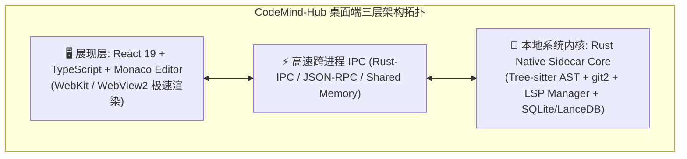
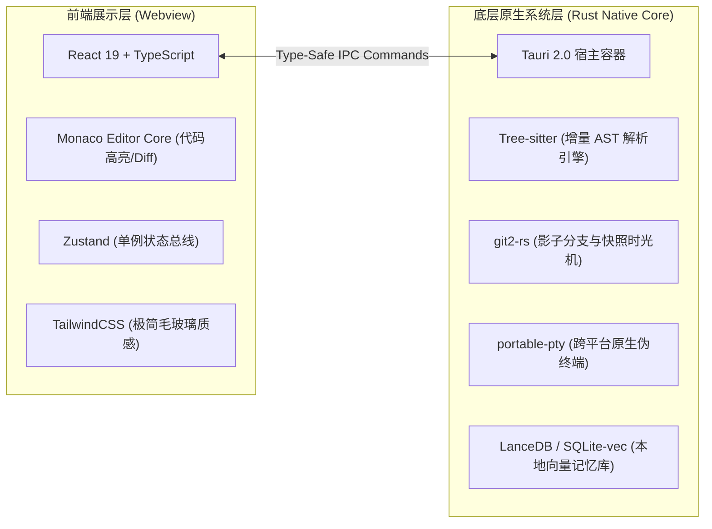
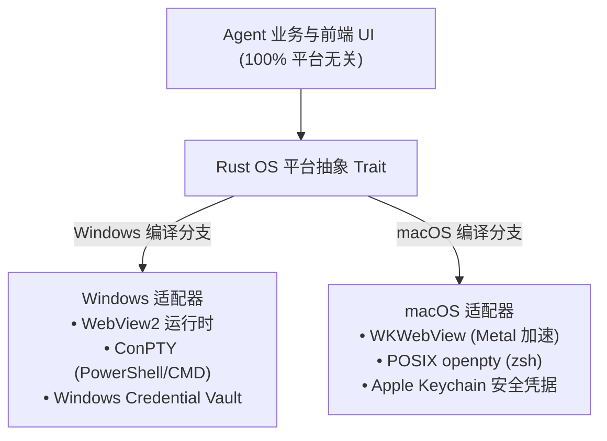

# CodeMind-Hub 桌面端技术选型决策与全景架构白皮书 (ADR)
> **决策主题**：CodeMind-Hub 桌面客户端与跨平台架构技术选型 (Windows 优先，无缝兼容 macOS)  
> **制定角色**：Principal Desktop & AI Systems Architect (桌面与系统级首席架构师) & Lead Agent Engineer  
> **文档版本**：v1.0 (Architecture Decision Record)  
> **归档路径**：`docs/technical_reviews/TECH_STACK_SELECTION_ADR.md`

---

## 一、选型背景与核心考量指标

作为一个面向专业开发者的**生产级多智能体协同开发平台 (Agentic AI IDE)**，桌面端的技术选型直接决定了：
1. **内存开销与启动性能 (Resource Footprint)**：开发者常驻运行，拒绝“内存刺客”；
2. **高频 AST 语法解析与本地 Git 算力 (Native AST & Git Performance)**：千万行代码的毫秒级依赖图谱构建；
3. **跨平台平滑演进能力 (Cross-Platform Windows ➔ macOS)**：Windows-first 落地，零成本移植 macOS (Apple Silicon ARM64)；
4. **安全性与本地沙箱隔离 (Local Security & Sandboxing)**：防止恶意脚本逃逸。

---

## 二、桌面客户端容器层：主流技术方案横向对比

| 评估维度 | 方案 A: **Tauri 2.0 + Rust (推荐)** | 方案 B: **Electron 3x** | 方案 C: **Code-OSS (VSCode Fork)** | 方案 D: **Flutter Desktop** |
| :--- | :--- | :--- | :--- | :--- |
| **打包体积** | **极小 (~15MB)** | 巨大 (150MB~300MB) | 巨大 (200MB+) | 中等 (~40MB) |
| **内存占用 (Idle)** | **极低 (~45MB~75MB)** | 高 (~350MB~600MB) | 高 (~400MB~800MB) | 中等 (~120MB) |
| **启动时间 (Cold Start)** | **毫秒级 (< 400ms)** | 慢 (1.5s ~ 3s) | 慢 (2s ~ 4s) | 较快 (~800ms) |
| **本地系统算力** | **Rust 原生性能 (多线程/SIMD/Tree-sitter)** | Node.js (单线程主循环易卡顿) | Node.js + C++ 插件 | C++ FFI / Dart |
| **Windows 适配度** | **完美 (原生嵌入 WebView2)** | 良好 (打包 Chromium) | 良好 (打包 Chromium) | 良好 (Win32 API) |
| **macOS 跨平台能力** | **完美 (原生 WKWebView + ARM64)** | 良好 (Universal Binary) | 良好 | 良好 |
| **安全沙箱隔离** | **系统级沙箱 + Rust 内存安全** | Node 权限过大，易遭原型链污染 | 依赖 VSCode 扩展沙箱 | 引擎自身沙箱 |

---

## 三、最终拍板定调技术栈 (The Recommended Tech Stack)

经过架构委员会严谨评审，**CodeMind-Hub 采用 “Tauri 2.0 (Rust) + React 19 / Monaco + 本地轻量化 Daemon” 混合分层架构**：

### 1. 桌面宿主层 (Desktop Shell Layer)
- **核心选型**：**`Tauri 2.0` (Rust 驱动)**
- **选型理由**：
  - **Windows 优先**：直接利用 Windows 10/11 内置的 `Microsoft Edge WebView2` 运行时，安装包仅约 12MB，极速分发；
  - **原生 Rust 算力**：Tree-sitter 代码分析、Git 差异比对、本地文件监控可以直接在 Rust 线程池并发执行，**绝不阻塞 UI 渲染帧率 (稳锁 60/120 FPS)**；
  - **平滑支持 macOS**：Tauri 2.0 原生编译为 macOS Universal Binary（原生支持 Apple Silicon M1/M2/M3/M4），无缝切换到 `WKWebView`。

### 2. 界面与编辑器层 (Frontend & Editor Layer)
- **核心框架**：**`React 19` + `TypeScript 5.x` + `Vite 6`**
- **代码编辑器内核**：**`@monaco-editor/react` (Monaco Editor)**
  - 选用 Monaco 的原因：与 VSCode 同根同源，完美支持 Inline Diff 差异比对、代码折叠、多光标编辑与 LSP 语法诊断高亮；
- **状态管理**：**`Zustand`**（轻量、单状态源、与我们的 SDD 契约纯函数 100% 契合）；
- **图标与样式**：**`Lucide React`** + 现代化 CSS 变量设计令牌（Design Tokens）。

### 3. 本地智能体执行内核 (Rust Native Agent Core)
- **增量 AST 语法引擎**：**`tree-sitter` (Rust binding)**
  - 支持多语言（TypeScript, Python, Rust, Go, Java）毫秒级增量 AST 节点提取与契约扫描；
- **原生终端仿真**：**`portable-pty`**
  - 在 Windows 下启动 `PowerShell.exe` / `cmd.exe`，在 macOS 下启动 `zsh` / `bash`，提供真实、支持 ANSI 色彩流的原生终端；
- **Git 底层引擎**：**`git2` (libgit2 Rust binding)**
  - 毫秒级创建 `refs/shadow-snapshots/*` 影子提交，零 Shell 进程创建开销；
- **本地向量嵌入库**：**`LanceDB embedded` 或 `sqlite-vec`**
  - 免服务端部署的嵌入式向量数据库，用于代码库语义检索与经验记忆库匹配。

---

## 四、跨平台演进路线：Windows ➔ macOS 平滑迁移方案

为了确保当前在 Windows 下的开发成果 100% 可复用于未来的 macOS 版本，架构设计中遵循 **“平台解耦隔离原则 (OS Abstraction Tier)”**：

### 1. 终端跨平台抹平 (Terminal Abstraction)
- Rust 端采用 `portable-pty` 统一抹平 Windows 的 `ConPTY` 与 macOS 的 `openpty`；
- 前端通过统一的 xterm.js 渲染，Windows 下默认 shell 配置为 `powershell.exe`，macOS 下自动感知 `$SHELL` (默认 `/bin/zsh`)。

### 2. 快捷键与按键映射 (Keybinding Normalization)
- 前端统一封装 `formatShortcut(key)` 工具函数：
  - Windows 环境：显示 `Ctrl+P`, `Ctrl+B`, `Alt+Enter`；
  - macOS 环境：自动映射为 `⌘P`, `⌘B`, `⌥Enter`。

### 3. 凭据与 API Key 安全存储 (Secure Storage)
- Windows 下对接 **Windows Credential Manager (DPAPI)**；
- macOS 下对接 **Apple Keychain Service**；
- 绝不将大模型 API Key 明文保存在 LocalStorage 或磁盘文件中。

---

## 五、项目工程实施落地步骤 (Implementation Blueprint)

| 阶段 | 里程碑任务 | 交付物 |
| :---: | :--- | :--- |
| **Phase 1 (当前阶段)** | **Tauri 2.0 + React 19 桌面骨架搭建** | 1. 初始化 `src-tauri` Rust 工程； 2. 接入 Vite 前端产物； 3. 打包生成 Windows `.msi` / 便携版 `.exe`。 |
| **Phase 2** | **Rust 原生 Sidecar 内核迁移** | 1. 将 AST 扫描与 Git 影子快照从前端 mock 迁移至 Rust `git2` 与 `tree-sitter`； 2. 接入 `portable-pty` 真实多标签终端。 |
| **Phase 3** | **macOS 交叉编译与自动化 CI** | 1. GitHub Actions 配置 Windows (x64) 与 macOS (Universal/Apple Silicon) 双平台构建； 2. 签名与自动更新流水线 (Tauri Updater)。 |

---

## 六、架构委员会选型决议 (Verdict)

> **架构选型结论**：  
> **【 拍板采用：Tauri 2.0 (Rust) + React 19 + Monaco Editor 架构 】**  
> 
> 既具备 Web 生态的极速 UI 迭代与 Monaco 工业级代码编辑能力，又拥有 Rust 原生的极低内存占用、毫秒级启动与极致系统算力，完美支撑从 Windows 到 macOS 的无缝演进。
