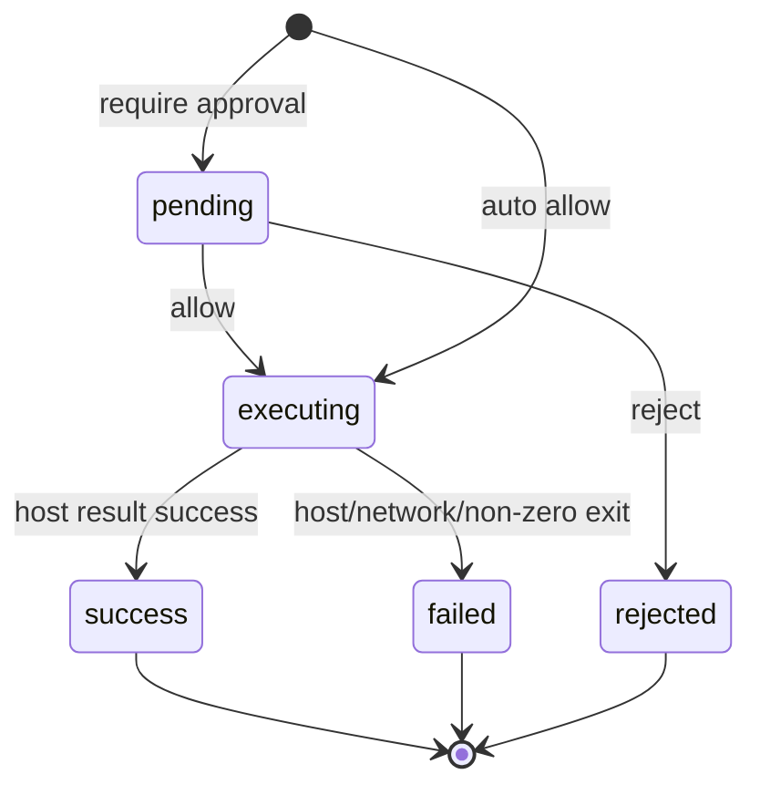

# Agent Loop 技术契约（原型阶段）

## Scope
将 Act 模式改造成可观察的多轮 Agent Loop。模型输出动作，控制器执行或申请审批，把真实结果回注给模型，直到模型仅输出文本或达到 10 轮上限。

## Non-goals
- 不为 Plan、Minimal、Creator 模式添加执行能力。
- 不从聊天代码块直接触发任何手动写盘/运行。
- 不把浏览器端审批当作宿主安全边界。

## 数据模型

```ts
export type AgentActionType = 'write_file' | 'run_command';
export type ActionExecutionStatus =
  | 'pending'
  | 'executing'
  | 'success'
  | 'failed'
  | 'rejected';

export interface AgentAction {
  id: string;
  type: AgentActionType;
  target: string;
  code: string;
  isHighRisk: boolean;
}

export interface ActionResult {
  actionId: string;
  type: AgentActionType;
  target: string;
  status: ActionExecutionStatus;
  output?: string;
  error?: string;
  exitCode?: number;
  fileSize?: number;
}
```

## 函数契约

| 函数 | 输入 | 输出 | 规则 |
| --- | --- | --- | --- |
| `parseAgentActions` | 模型文本 | `AgentAction[]` | 仅闭合的 `write_file:` 与精确 `run_command` 围栏生成动作；普通 shell 代码块始终展示而不执行。 |
| `shouldRequireActionApproval` | 策略、动作、会话低风险授权 | `boolean` | 严格审核全部确认；风险自适应仅确认高风险；所有高风险动作均不可由会话选择跳过。 |
| `createActionResult` | 动作、状态、可选宿主字段 | `ActionResult` | 必须复制 actionId；无结果时可显示 pending/executing。 |
| `formatExecutionFeedback` | 动作、结果 | `string` | 严格按 actionId 配对；可读、有限长度、包含失败/拒绝理由。 |
| `getActionResultForId` | actionId、结果 | `ActionResult \| undefined` | 仅按稳定 ID 查找，禁止按渲染顺序错配。 |

## 状态机



## 前置测试（Red）
1. 多个动作能按围栏顺序解析出稳定 ID，普通 `bash` 代码不能被错误识别。
2. `strict_approval` 始终审批；`risk_adaptive` 仅审批高风险；会话低风险授权不放行高风险。
3. 反馈按 `actionId` 而非数组位置关联；拒绝和错误必须可被模型读取。
4. Markdown 同一解析器识别动作，历史/普通代码块显示为 `idle`，不产生执行按钮。
